# ManPaSik 종합 시스템 상세 기획서 (Comprehensive System Blueprint v3.0)

**문서번호**: MPK-BLUEPRINT-v3.0  
**작성일**: 2026-02-12  
**목적**: 시스템 전체 구현기획서와 세부기획서를 종합 분석하여 완벽한 시스템 구축을 위한 상세 기획서  
**참조**: [SPRINT2-EXECUTION-PLAN](SPRINT2-EXECUTION-PLAN.md), [MPK-ECO-PLAN-v1.1-COMPLETE](MPK-ECO-PLAN-v1.1-COMPLETE.md), [COMPREHENSIVE-IMPLEMENTATION-MASTERPLAN-v2.0](COMPREHENSIVE-IMPLEMENTATION-MASTERPLAN-v2.0.md), [docs/ux/sitemap.md](../ux/sitemap.md)

---

## 분석 범위

- **기획서 9건**: SPRINT2-EXECUTION-PLAN, SPRINT2-AS-BACKEND-DETAIL, SPRINT2-FLUTTER-DETAIL, SPRINT2-COMPLIANCE-DETAIL, SPRINT2-INFRA-E2E-DETAIL, MPK-ECO-PLAN-v1.1-COMPLETE, COMPREHENSIVE-IMPLEMENTATION-MASTERPLAN-v2.0, original-detail-annex, plan-original-vs-current-and-development-proposal
- **스펙 문서 8건**: cartridge-system-spec, event-schema-specification, non-functional-requirements, deployment-strategy, offline-capability-matrix, test-strategy, data-packet-family-c, admin-settings-llm-assistant-spec
- **UX 문서 4건**: sitemap.md, storyboard-first-measurement.md, storyboard-food-calorie.md, DESIGN_SYSTEM.md
- **Proto 정의**: 22개 gRPC 서비스, 155+ RPC 메서드
- **DB 스키마**: 25개 SQL 초기화 파일, 80+ 테이블
- **Kafka 토픽**: 17개 이벤트 스키마

---

## Part 1: 기존 기획 종합 분석

### 1.1 핵심 요소 매트릭스 (기획서별 Coverage)

| 기획서 | 아키텍처 | 기능 명세 | UX/사이트맵 | 보안/규제 | 인프라/E2E | 완성도 |
| --- | --- | --- | --- | --- | --- | --- |
| SPRINT2-EXECUTION-PLAN | O | O | △ | △ | O | 85% |
| SPRINT2-AS-BACKEND-DETAIL | O | O | - | O | - | 90% |
| SPRINT2-FLUTTER-DETAIL | △ | O | O | - | - | 80% |
| SPRINT2-COMPLIANCE-DETAIL | O | O | - | O | - | 85% |
| SPRINT2-INFRA-E2E-DETAIL | O | O | - | △ | O | 85% |
| MPK-ECO-PLAN-v1.1-COMPLETE | O | O | O | △ | △ | 75% |
| COMPREHENSIVE-IMPLEMENTATION-MASTERPLAN-v2.0 | O | O | O | O | O | 90% |
| original-detail-annex | △ | O | - | △ | △ | 60% |
| plan-original-vs-current-and-development-proposal | O | O | △ | O | △ | 80% |

### 1.2 현재 기획의 강점 (5가지)

1. **명확한 마이크로서비스 아키텍처**
   - 22개 gRPC 서비스, 155+ RPC 메서드로 도메인 분리
   - handler → service → repository 패턴 일관 적용
   - Kong + Keycloak 기반 API Gateway 및 인증

2. **보안 및 규제 대응**
   - AES-256-GCM 민감 설정 암호화, JWT 15분/7일, TLS 1.3
   - IEC 62304 Class B 대응 (SDP, SRS, SAD 문서화)
   - OWASP Top 10, GDPR/PIPA 동의 6종, 의료 데이터 10년 보존 정책

3. **카트리지 무한 확장성**
   - 2-byte 레지스트리(65,536종), 4-byte 확장 경로
   - 구독 등급별 접근(INCLUDED/LIMITED/ADD_ON/RESTRICTED/BETA)
   - NFC v2.0 레이아웃, 서드파티 SDK 마켓(0xF0~0xFD)

4. **이벤트 기반 연동**
   - Kafka 17개 토픽, 공통 엔벨로프(event_id, event_type, payload)
   - ConfigWatcher 기반 설정 핫리로드(manpasik.config.changed)
   - 측정/결제/구독/알림/AI 리스크 등 이벤트 드리븐 플로우

5. **비기능 요구사항 정량화**
   - NFR 문서: P95 응답시간, RPS/CCU Phase별 목표, SLA 99%~99.99%
   - Rust 코어 벤치마크(핑거프린트 <100μs), 오프라인 100% 목표

### 1.3 보완점 (7가지)

| 보완점 | 설명 | 우선순위 |
| --- | --- | --- |
| **ConfigMetadata/Translation PostgreSQL 미구현** | admin-service 설정 메타·다국어가 인메모리만 사용, DB 재시작 시 시드로 초기화 | P1 |
| **Rust FFI 브리지 비활성화** | main.dart에서 RustBridge.init() 주석 처리, Flutter에서 Rust 코어 미사용 | P0 |
| **Proto 수동 코드** | admin_config_ext.go 수동 작성, protoc 재생성 시 충돌 가능 | P1 |
| **Flutter Feature 부족** | market, medical, community, family Feature 미구현; 단위 테스트 60개 미달 | P1 |
| **오프라인 미검증** | 오프라인 기능 매트릭스 문서는 있으나 실제 CRDT/동기화 검증 부족 | P2 |
| **관리자 계층형 미구현** | 사이트맵의 국가/지역/지점/판매점 계층형 관리 미반영 | P2 |
| **화상진료 미연동** | VideoService/Telemedicine 정의되어 있으나 TURN/WebRTC 실제 연동 미완 | P2 |

### 1.4 구현 완성도 대시보드 (Phase별)

| Phase | 영역 | 완성도 | 비고 |
| --- | --- | --- | --- |
| **Phase 1** | Auth, User, Device, Measurement | 90% | E2E 헬스·측정 플로우 검증됨 |
| **Phase 1** | Flutter: Home, Measurement, Devices, Settings | 85% | 라우트 8개, Feature 6개 |
| **Phase 1** | Rust 코어 엔진 | 70% | FFI 비활성, BLE/NFC 스텁 |
| **Phase 2** | Subscription, Shop, Payment, AiInference, Cartridge, Calibration, Coaching | 85% | gRPC·DB·Docker 완료 |
| **Phase 2** | Admin 설정(AS-1~5), ConfigWatcher, E2E 확장 | 80% | PG 메타/번역 미구현 |
| **Phase 2** | Flutter Admin UI, DataHub, Coach, Market | 30% | Admin UI·마켓 미구현 |
| **Phase 3** | Reservation, Prescription, Community, Family, HealthRecord, Video, Notification, Translation | 60% | 서비스·DB 정의됨, Flutter 미연동 |
| **Phase 3** | 관리자 포탈 계층형, 규제 문서(SDP/SRS/SAD) | 50% | 문서 초안 있음, 계층형 미구현 |
| **인프라** | Docker Compose, K8s Base, E2E | 75% | 32+ 서비스, overlay·Grafana 보강 필요 |

---

## Part 2: 시스템 아키텍처 상세 설계

### 2.1 전체 시스템 아키텍처

```mermaid
flowchart TB
  subgraph client [Client Layer]
    Flutter[Flutter App]
    Web[Next.js Web]
  end

  subgraph gateway [Gateway Layer]
    Kong[Kong API Gateway]
    Keycloak[Keycloak OIDC]
  end

  subgraph grpc [Go gRPC Services]
    Auth[AuthService]
    User[UserService]
    Device[DeviceService]
    Measurement[MeasurementService]
    Subscription[SubscriptionService]
    Shop[ShopService]
    Payment[PaymentService]
    AI[AiInferenceService]
    Cartridge[CartridgeService]
    Calibration[CalibrationService]
    Coaching[CoachingService]
    Admin[AdminService]
    Notif[NotificationService]
    Family[FamilyService]
    HealthRec[HealthRecordService]
    Community[CommunityService]
    Video[VideoService]
    Reservation[ReservationService]
    Prescription[PrescriptionService]
    Translation[TranslationService]
  end

  subgraph data [Data Layer]
    PG[(PostgreSQL)]
    TS[(TimescaleDB)]
    Redis[(Redis)]
    Milvus[(Milvus)]
    ES[(Elasticsearch)]
    MinIO[(MinIO)]
  end

  subgraph events [Event Layer]
    Kafka[Kafka/Redpanda]
  end

  Flutter --> Kong
  Web --> Kong
  Kong --> Keycloak
  Kong --> Auth
  Kong --> User
  Kong --> Device
  Kong --> Measurement
  Kong --> Subscription
  Kong --> Shop
  Kong --> Payment
  Kong --> AI
  Kong --> Admin
  Kong --> Notif
  Auth --> PG
  User --> PG
  Device --> PG
  Measurement --> TS
  Measurement --> Milvus
  Payment --> PG
  Payment --> Kafka
  Admin --> PG
  Admin --> Kafka
  Notif --> Redis
  Notif --> Kafka
  AI --> Milvus
  Cartridge --> PG
  Coaching --> PG
  Coaching --> Kafka
```

### 2.2 마이크로서비스 의존성 맵 (22개 서비스)

| 서비스 | 포트 | 의존 DB | 의존 이벤트 | 다운스트림 |
| --- | --- | --- | --- | --- |
| auth-service | 50051 | PostgreSQL | - | user, notification |
| user-service | 50052 | PostgreSQL | user.registered | coaching, health-record |
| device-service | 50053 | PostgreSQL | device.registered, device.status.changed | measurement, notification |
| measurement-service | 50054 | TimescaleDB, Milvus | measurement.completed, session.* | ai-inference, coaching |
| subscription-service | 50055 | PostgreSQL | subscription.changed | cartridge, notification |
| shop-service | 50056 | PostgreSQL | - | payment |
| payment-service | 50057 | PostgreSQL | payment.completed, payment.failed | subscription, notification |
| ai-inference-service | 50058 | Milvus | measurement.completed | ai.risk.detected |
| cartridge-service | 50059 | PostgreSQL | cartridge.verified, cartridge.depleted | measurement, shop |
| calibration-service | 50060 | PostgreSQL | - | measurement |
| coaching-service | 50061 | PostgreSQL | measurement.completed, user.profile.updated | notification |
| notification-service | 50062 | Redis, PostgreSQL | notification.send (consumer) | - |
| family-service | 50063 | PostgreSQL | - | health-record |
| health-record-service | 50064 | PostgreSQL | prescription.created | - |
| community-service | 50065 | PostgreSQL | community.post.created | notification, translation |
| reservation-service | 50066 | PostgreSQL | reservation.created | telemedicine |
| admin-service | 50067/50068 | PostgreSQL | config.changed (publisher) | payment, notification (watcher) |
| prescription-service | 50069 | PostgreSQL | prescription.created | health-record, notification |
| video-service | 50070 | PostgreSQL | - | - |
| telemedicine-service | 50071 | PostgreSQL | reservation.created | video |
| translation-service | 50073 | PostgreSQL | community.post.created | - |
| gateway | 8090 | - | - | 모든 gRPC |

### 2.3 데이터베이스 설계 (80+ 테이블 ERD)

**도메인별 테이블 목록**  
**인증·사용자**: users, refresh_tokens, user_profiles, subscriptions, subscription_plans, subscription_history  
**디바이스**: devices, device_events, firmware_versions, firmware_updates  
**측정**: measurements (Hypertable), measurement_sessions, measurement_data  
**상거래**: products, cart_items, orders, order_items, payments, refunds, cartridge_addon_purchases  
**AI**: analysis_results, biomarker_results, anomaly_flags, health_scores, ai_models  
**카트리지**: cartridge_categories, cartridge_types, cartridge_tier_access, cartridge_usage_log  
**보정**: calibration_records, calibration_models  
**코칭**: health_goals, coaching_messages, daily_health_reports, weekly_health_reports, recommendations  
**가족**: family_groups, family_members, family_invitations, sharing_preferences  
**건강기록**: health_records, health_record_attachments, health_record_shares, data_sharing_consents  
**의료**: doctors, consultations, video_sessions, facilities, time_slots, reservations, prescriptions, prescription_medications, drug_interactions, medication_taken_logs, prescription_fulfillment_logs  
**커뮤니티**: posts, comments, post_likes, challenges, challenge_participants  
**비디오**: video_rooms, video_participants, video_signals, video_room_stats  
**알림**: notifications, notification_preferences, device_tokens  
**번역**: translation_records, translation_usage, medical_terms, supported_languages  
**관리자**: admin_users, audit_logs, system_configs, config_metadata, config_translations, llm_config_sessions, llm_config_messages, config_change_queue  
**지역/시설**: regions, facilities (22-regions-facilities-doctors)

**ERD 관계도 (텍스트)**  
```
users (1)──< refresh_tokens
users (1)──< user_profiles
users (1)──< subscriptions >── subscription_plans
users (1)──< devices >── device_events, firmware_updates
users (1)──< measurement_sessions >── measurement_data, measurements(TimescaleDB)
users (1)──< family_groups >── family_members, family_invitations, sharing_preferences
users (1)──< health_records >── health_record_attachments, health_record_shares
users (1)──< orders >── order_items, payments, refunds
users (1)──< notifications, notification_preferences, device_tokens
users (1)──< health_goals, coaching_messages, recommendations
users (1)──< posts >── comments, post_likes
users (1)──< reservations >── video_sessions
products (1)──< cart_items
orders (1)──< order_items, payments
cartridge_types (1)──< cartridge_tier_access, cartridge_usage_log
devices (1)──< calibration_records
prescriptions (1)──< prescription_medications, medication_taken_logs
facilities (1)──< doctors, time_slots, reservations
challenges (1)──< challenge_participants
video_rooms (1)──< video_participants, video_signals, video_room_stats
system_configs (1)──< config_metadata, config_translations
```

### 2.4 데이터 흐름도 (3대 핵심 플로우)

**측정 플로우**:  
Flutter → Gateway → MeasurementService.StartSession → DeviceService 상태 확인 → StreamMeasurement(실시간) → EndSession → measurement.completed 발행 → AiInference/Coaching/Notification 구독

**결제 플로우**:  
Flutter → Gateway → ShopService (Cart/Order) → PaymentService.CreatePayment → Toss PG 연동 → ConfirmPayment → payment.completed 발행 → SubscriptionService/NotificationService 구독

**진료 플로우**:  
Flutter → ReservationService (SearchFacilities, GetAvailableSlots, CreateReservation) → reservation.created → TelemedicineService → VideoService.CreateRoom/JoinRoom → PrescriptionService (처방 생성) → prescription.created → HealthRecordService/Notification 구독

---

## Part 3: 기능별 상세 프로세스 플로우

### 3.1 홈 (Home) – Phase 1

```mermaid
flowchart LR
  A[진입] --> B{인증}
  B -->|미인증| C[로그인]
  B -->|인증됨| D[건강 요약 로드]
  D --> E[대시보드 표시]
  E --> F[빠른 측정 버튼]
  F --> G[/measure]
  E --> H[알림 센터]
  H --> I[NotificationService.ListNotifications]
```

**예외 경로**: 세션 만료 → RefreshToken 실패 시 /login 리다이렉트.

### 3.2 측정 (Measure) – Phase 1

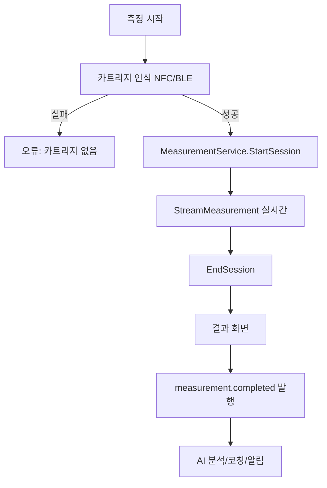

**에러 경로**: 디바이스 연결 실패 → BLE 재스캔; 세션 타임아웃 → 자동 EndSession 후 결과 저장.

### 3.3 데이터 허브 (Data Hub) – Phase 2

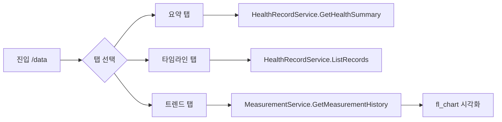

### 3.4 AI 코치 (Coach) – Phase 2

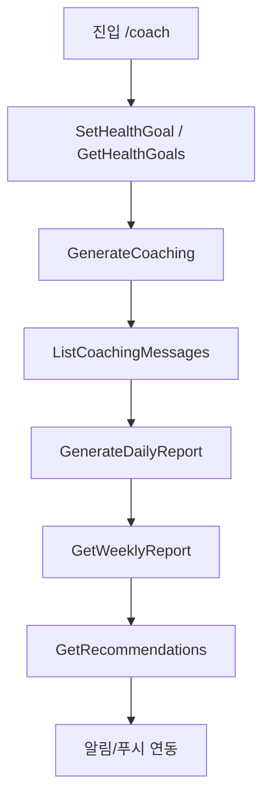

**음식 칼로리**: VisionService 이미지 업로드 → AiInference 분석 → 코칭 메시지 반영.

### 3.5 마켓 (Market) – Phase 2

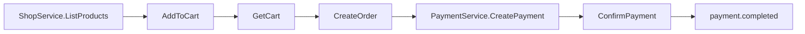

**구독 연동**: SubscriptionService.CheckFeatureAccess, ListSubscriptionPlans, CartridgeService.ListAccessibleCartridges.

### 3.6 커뮤니티 (Community) – Phase 3

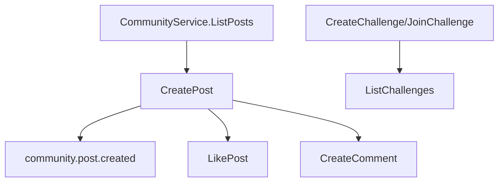

### 3.7 의료 서비스 (Medical) – Phase 3

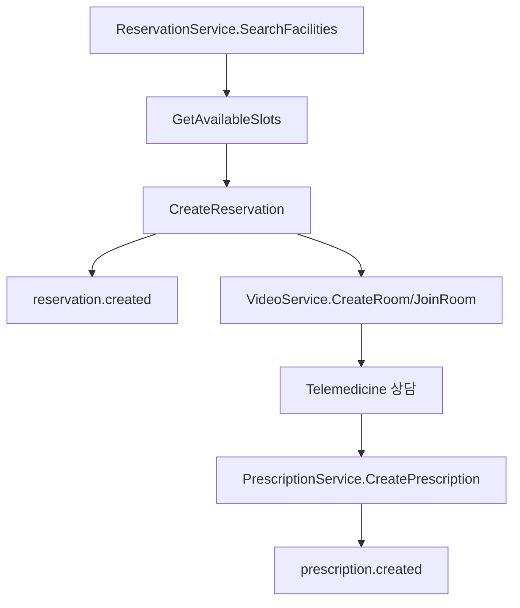

### 3.8 기기 관리 (Devices) – Phase 1

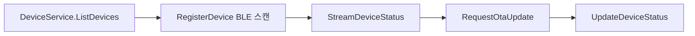

### 3.9 가족 (Family) – Phase 3

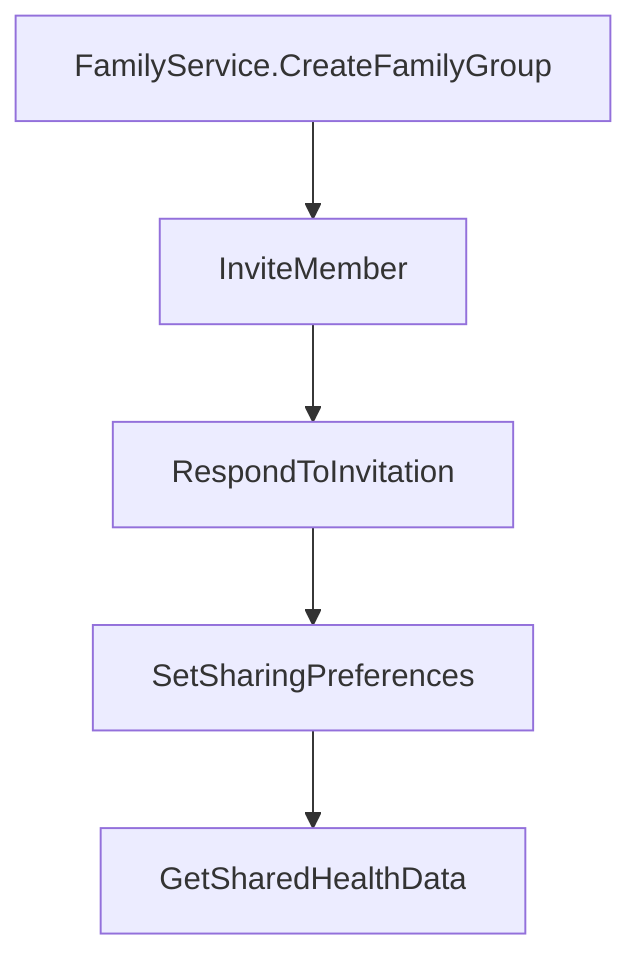

### 3.10 설정 (Settings) – Phase 1

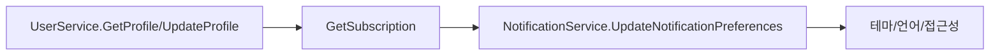

### 3.11 관리자 포탈 (Admin) – Phase 3

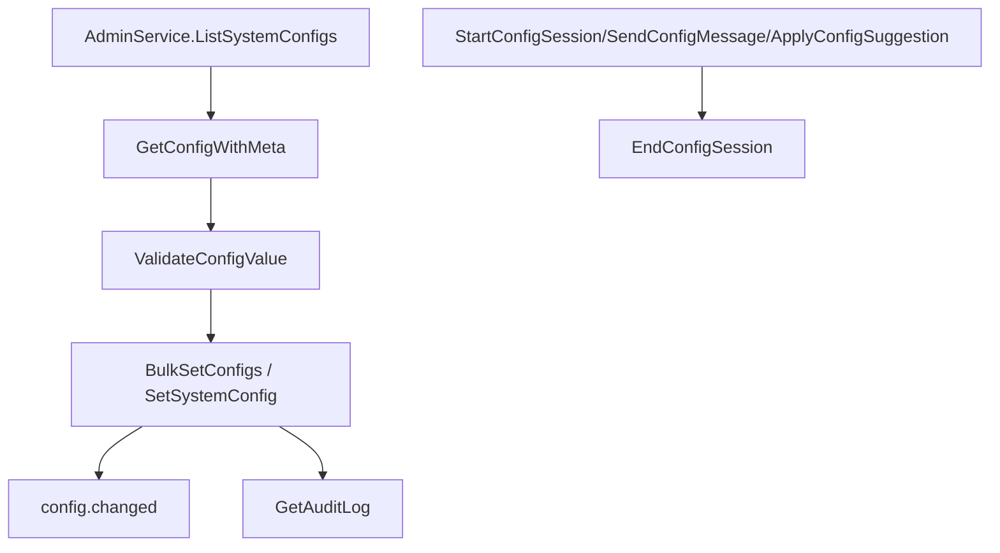

---

## Part 4: UI/UX 개선 전략

### 4.1 Dynamic Heritage 디자인 시스템 확장

**참조**: [docs/DESIGN_SYSTEM.md](../DESIGN_SYSTEM.md)  
- **색상**: Primary #00897B (Celadon Teal), Secondary #1A237E (Deep Sea Blue), Accent #D32F2F (Dancheong Red), Surface #FAFAFA (Hanji White), Dark surface #1E1E1E.  
- **타이포**: Gowun Batang(제목), Noto Sans KR(본문).  
- **확장 제안**: Glassmorphism + Hanji 텍스처 유지, 물결 효과(Water Ripple) 터치 피드백, 데이터 흐름 라인 애니메이션(측정 중 실시간 그래프).

### 4.2 사용자 여정 최적화

| 여정 | 목표 | 전략 |
| --- | --- | --- |
| **첫 측정** | 3탭 이내 측정 시작 | 온보딩 최소화, 카트리지 자동 인식 강조, 단계별 애니메이션 가이드 |
| **구독 전환** | 결제 이탈 감소 | Free→Basic 업셀 명확한 가치 메시지, 체크아웃 단일 플로우 |
| **긴급 상황** | 위험 감지 시 신속 대응 | ai.risk.detected 시 시각적/음성 알림, 119/보호자 연락 바로가기, 안전 모드(야간/독거) 설정 |

### 4.3 접근성 WCAG 2.1 AA 구현 체크리스트

- 대비: 텍스트 4.5:1, 큰 텍스트 3:1.  
- 터치 타겟: 최소 44×44 pt.  
- 스크린 리더: 시맨틱 라벨, LiveRegion 결과 알림.  
- 포커스: 키보드/스위치 네비게이션, 포커스 링 명시.  
- 다크모드: 100% 화면 대응(현재 app_theme.dart 적용됨).  
- 다국어: 6개 언어(ko/en/ja/zh/fr/hi), RTL 미요구.

### 4.4 반응형 및 크로스 플랫폼

- **모바일 우선**: 768px 미만 단일 컬럼, BottomNav.  
- **태블릿/데스크톱**: 768px 이상 좌우 분할(예: Admin 설정 채팅 3:2).  
- **Flutter Web/Desktop**: 동일 라우트 구조, 브레이크포인트 기반 레이아웃.  
- **콘텐츠**: 이미지/차트 비율 유지, 텍스트 리플로우.

---

## Part 5: 인터페이스 설계

### 5.1 REST API 전체 엔드포인트 명세 (게이트웨이 기준)

**기준**: `backend/gateway/internal/router/router.go`. Base URL: `/api/v1`.

| 메서드 | 경로 | gRPC 서비스 | 용도 |
| --- | --- | --- | --- |
| GET | /health, /health/live, /health/ready | 로컬 | 헬스체크 |
| GET | /api/v1/version | 로컬 | 버전 |
| POST | /api/v1/auth/register, /login, /refresh, /logout | AuthService | 인증 |
| GET/PUT | /api/v1/users/{userId}/profile | UserService | 프로필 |
| POST | /api/v1/measurements/sessions | MeasurementService | 세션 시작 |
| POST | /api/v1/measurements/sessions/{sessionId}/end | MeasurementService | 세션 종료 |
| GET | /api/v1/measurements/history | MeasurementService | 측정 이력 |
| POST/GET | /api/v1/devices | DeviceService | 디바이스 등록/목록 |
| GET | /api/v1/facilities, /api/v1/facilities/{id} | ReservationService | 시설 검색/조회 |
| POST/GET | /api/v1/reservations, /api/v1/reservations/{id} | ReservationService | 예약 |
| GET/POST | /api/v1/prescriptions/* | PrescriptionService | 처방/약국 |
| GET/POST/DELETE | /api/v1/subscriptions/* | SubscriptionService | 구독 |
| GET/POST | /api/v1/products, /api/v1/products/{id} | ShopService | 상품 |
| POST/GET | /api/v1/cart, /api/v1/cart/{userId} | ShopService | 장바구니 |
| POST/GET | /api/v1/orders | ShopService | 주문 |
| POST/GET | /api/v1/payments/* | PaymentService | 결제 |
| GET/POST | /api/v1/health-records/* | HealthRecordService | 건강기록 |
| GET/POST | /api/v1/notifications/* | NotificationService | 알림 |
| GET/POST | /api/v1/posts/* | CommunityService | 커뮤니티 |
| GET | /api/v1/admin/* | AdminService | 관리자 |
| POST/GET | /api/v1/ai/* | AiInferenceService | AI 추론 |
| POST/GET | /api/v1/cartridges/* | CartridgeService | 카트리지 |
| POST/GET | /api/v1/calibration/* | CalibrationService | 보정 |
| POST/GET | /api/v1/coaching/* | CoachingService | 코칭 |
| POST/GET/DELETE | /api/v1/files/upload, /api/v1/files/{path} | 로컬 | 파일 업로드/다운로드/삭제 |

인증: `Authorization: Bearer <JWT>`. 관리자 경로는 RBAC 역할 admin 필요.

### 5.2 Kafka 이벤트 토폴로지 (Producer-Consumer 맵)

**참조**: [docs/specs/event-schema-specification.md](../specs/event-schema-specification.md)

| 토픽 | Producer | Consumer(s) |
| --- | --- | --- |
| manpasik.measurement.completed | measurement-service | ai-inference, coaching, notification |
| manpasik.measurement.session.started/ended | measurement-service | device-service, coaching, health-record |
| manpasik.payment.completed/failed | payment-service | subscription, shop, notification, admin |
| manpasik.subscription.changed | subscription-service | cartridge, notification, user |
| manpasik.cartridge.verified/depleted | cartridge-service | measurement, notification, shop |
| manpasik.notification.send | 다수 서비스 | notification-service |
| manpasik.user.registered | auth-service | user, notification, coaching |
| manpasik.user.profile.updated | user-service | coaching, health-record |
| manpasik.device.registered/status.changed | device-service | notification, admin |
| manpasik.ai.risk.detected | ai-inference-service | notification, coaching, emergency |
| manpasik.reservation.created | reservation-service | notification, telemedicine |
| manpasik.prescription.created | prescription-service | notification, health-record |
| manpasik.community.post.created | community-service | notification, translation |
| manpasik.config.changed | admin-service | payment-service, notification-service (ConfigWatcher) |
| manpasik.dlq | 전체 | admin (수동 재처리) |

### 5.3 외부 시스템 연동

| 외부 시스템 | 용도 | 연동 방식 | 비고 |
| --- | --- | --- | --- |
| **Toss Payments** | 결제 PG | REST API (toss.secret_key, toss.api_url) | payment-service, DB/env fallback. 참조: docs/plan/B3-toss-pg-integration.md |
| **FCM** | 푸시 알림 | HTTP v1 API (fcm.server_key, fcm.project_id) | notification-service, ConfigWatcher 연동 |
| **HealthKit / Google Health Connect** | 건강 데이터 동기화 | 플랫폼 SDK (Flutter plugin) | 데이터 허브 내보내기/가져오기 |
| **TURN/STUN** | 화상진료 WebRTC | TURN 서버 URL 환경변수 | VideoService/Telemedicine |
| **MQTT (Mosquitto)** | 디바이스 실시간 명령 | MQTT 3.1.1 | device-service (선택) |
| **OpenAI/Anthropic** | LLM 설정 어시스턴트 | REST API | admin-service AS-7/AS-8 |
| **STT/TTS·음성 복제** | 실시간 번역(음성→텍스트→번역→음성), 같은 음성 번역 | 외부 API 또는 자체 모델 | TranslationService·10.8 Voice-Clone 연동 |

### 5.4 BLE/NFC 디바이스 통신 프로토콜

- **BLE**: btleplug 기반, GATT 서비스/캐릭터리스틱 정의. 측정 패킷 형식은 [docs/specs/data-packet-family-c.md](../specs/data-packet-family-c.md) (패밀리C) 준수. 스캔 → 연결 → 스트리밍(StreamMeasurement).
- **NFC**: ISO 14443A, 카트리지 태그 v2.0 (80+ 바이트 레이아웃). Category(8b)×TypeIndex(8b) 2-byte 레지스트리. ReadCartridge/ValidateCartridge 전 파싱.
- **Rust**: manpasik-engine의 ble, nfc 모듈; Flutter는 FFI 활성화 시 Rust 호출, 현재 스텁 사용.

---

## Part 6: 페이지별 상세 기획

### 6.1 사이트맵 11개 섹션 x 기능 명세

**참조**: [docs/ux/sitemap.md](../ux/sitemap.md), [docs/ux/storyboard-first-measurement.md](../ux/storyboard-first-measurement.md), [docs/ux/storyboard-food-calorie.md](../ux/storyboard-food-calorie.md)

| 경로 | 화면 | Phase | 핵심 기능 | gRPC/API |
| --- | --- | --- | --- | --- |
| / | HomeScreen | 1 | 건강 요약, 환경 요약, AI 코칭 요약, 빠른 측정, 알림 | User, Measurement, Coaching, Notification |
| /measure | MeasurementScreen | 1 | 카트리지 인식, 단계별 가이드, 실시간 모니터링, 결과/해석 | Device, Measurement, Cartridge |
| /measurement/result | MeasurementResultScreen | 1 | 수치 해석, AI 종합, 이상 항목, 과거 대비 | Measurement, AiInference |
| /data | DataHubScreen | 2 | 타임라인, 트렌드 차트, 개인 기준선, 내보내기(PDF/CSV/FHIR) | HealthRecord, Measurement |
| /coach | AiCoachScreen | 2 | 대화형 상담, 일/주간 리포트, 목표 설정, 음식 칼로리 | Coaching, AiInference |
| /market | ShopScreen | 2 | 상품 목록, 장바구니, 주문, 결제, 구독 플랜 | Shop, Payment, Subscription, Cartridge |
| /community | CommunityScreen | 3 | 포럼, Q&A, 챌린지, 실시간 번역 채팅 | Community, Translation |
| /medical | MedicalScreen | 3 | 화상진료, 예약, 처방, 건강 데이터 공유 | Reservation, Video, Prescription, HealthRecord |
| /devices | DeviceListScreen | 1 | 리더기 목록/추가, 펌웨어 OTA, 상태 모니터링 | Device |
| /family | FamilyScreen | 3 | 가족 구성원, 보호자 모니터링, 건강 리포트, 긴급 연락망 | Family |
| /settings | SettingsScreen | 1 | 계정, 구독, 알림, 접근성, 테마, 언어, 긴급 대응 | User, Subscription, Notification |
| /admin/* | AdminPortal | 3 | 설정 목록/편집, 감사 로그, LLM 어시스턴트, 계층형(미구현) | Admin, AiInference |

### 6.2 네비게이션 구조

- **모바일**: BottomNav 5개 (홈, 측정, 데이터허브/코치, 마켓/커뮤니티, 설정). Drawer: 프로필, 기기, 가족, 의료, 관리자(역할 시).
- **라우트 ID**: docs/ux/sitemap.md 기준. 인증 미완료 시 /login; 관리자 경로는 역할 검증 후 /admin/settings, /admin/settings/assistant.

### 6.3 컴포넌트 재사용성 계획

- **공통**: MeasurementCard, JagaePattern(시각화), ConfigCard, ConfigEditDialog, ChangeReasonDialog.  
- **레이아웃**: 반응형 BreakpointLayout(768px), CategoryTabBar, SearchBar.  
- **폼**: valueType별 입력(string, number, boolean, secret, url, select, json, multiline), 마크다운 help_text(flutter_markdown).  
- **공유 위젯**: 코칭 카드, 채팅 버블, 차트(fl_chart) 래퍼.

### 6.4 콘텐츠 관리 전략

- **다국어**: 6개(ko/en/ja/zh/fr/hi), app_ko.arb 등 ARB + AppLocalizations.  
- **의료 용어**: translation_usage, medical_terms 테이블; TranslationService.TranslateText 연동.  
- **설정 도움말**: config_translations (help_text per key/lang).  
- **관리자 LLM**: 다국어 자동 번역 + config_change_queue(AS-9).

### 6.5 일반인용 건강데이터 페이지 — 가독성·직관력 극대화

- **목표**: 통계·분류된 개인 건강데이터를 **일반인이 쉽게 파악·이해**할 수 있도록, 가독성과 직관력을 극대화한 페이지 구성·데이터 배치·제공 방식. “쉽고 재미있게” 시각·구성으로 설계.

#### 6.5.1 설계 원칙

- **용어**: 의료 용어 최소화. “혈당” 대신 “당 수치”, “HbA1c”는 “3개월 평균 당” 등 **일상어·한 문장 설명** 병기. 툴팁/접이식에서만 전문 용어 선택 노출.
- **시각 계층**: 한 화면에 “한 가지 메시지” 우선. 상단 = 오늘/이번 주 결론(좋음/주의/관리 필요), 이하 = 이유·세부.
- **색·아이콘 일관**: 정상 = Celadon Teal(#00897B)·체크/웃는 얼굴, 주의 = Amber·경고 아이콘, 위험/관리필요 = Dancheong Red(#D32F2F)·느낌표. Part 4 Dynamic Heritage 유지.
- **재미·몰입**: 작은 성취 배지, “N일 연속 측정” 스트릭, 진행률 링·게이지, 한 줄 코칭 문구로 긍정 톤 유지.

#### 6.5.2 페이지 구성·데이터 배치 (일반인)

##### 1) 홈·오늘 요약 (HomeScreen 상단 블록)

- **배치**: 상단 1/4 — “오늘의 건강 한 줄” (예: “오늘도 좋은 편이에요” / “당 수치 한 번 확인해보면 좋겠어요”). 바로 아래 **건강 점수 원형 게이지**(0~100, 색상 구간: 빨강/노랑/초록).  
- **데이터**: HealthRecordService.GetHealthSummary 또는 CoachingService 요약. **제공 방식**: 숫자보다 “등급+한 줄 문장”.  
- **그 다음**: 카드 2~3개 가로 스크롤 — “측정 요약”(최근 1회 수치·정상/주의 표시), “오늘 환경”(미세먼지 등 한 줄), “AI 코치 한 마디”. 터치 시 상세 페이지로.

##### 2) 데이터 허브 — 통계·분류 (DataHubScreen)

- **탭 구조**: [요약] [타임라인] [트렌드] [내 기준선].
- **요약 탭**  
  - **배치**: 상단 “이번 주/이번 달 종합” 카드(등급·한 줄). 이하 **분류별 카드 그리드**(2열): “심장·혈압”, “당·대사”, “영양”, “환경”, “복약” 등. 각 카드 = **아이콘 + 분류명 + 상태(정상/주의/관리필요) + 최근 대표값 1개**(예: “혈압 120/80”) + “자세히 보기” 링크.  
  - **제공 방식**: 수치는 큰 글씨·단위 명시. 상태는 색 테두리·아이콘으로만으로도 구분 가능.  
- **타임라인 탭**  
  - **배치**: 날짜별 리스트. 각 행 = 날짜 + “측정 N회” + 대표 상태 뱃지 + 탭 시 해당 일 상세(측정·식단·복약 요약).  
  - **제공 방식**: “언제 뭐가 있었는지” 스토리처럼 읽히도록.  
- **트렌드 탭**  
  - **배치**: 기간 선택(1주/1달/3달) 후 **단순 라인·영역 차트**. Y축은 “내 기준선 대비” 또는 절대값(선택). X축 = 날짜.  
  - **제공 방식**: 차트 위/아래에 “한 줄 해석”(예: “지난 2주간 조금 올라왔어요”). fl_chart 등으로 부드러운 곡선·색 구간.  
- **내 기준선 탭**  
  - **배치**: 항목별 “내 정상 범위”(My Zone) 막대 또는 범위 표시 + “이 범위가 나의 평소예요” 문구.  
  - **제공 방식**: 일반인용으로 “너무 높음/적당/너무 낮음” 3구간 색으로만 보여도 이해 가능.

##### 3) 측정 결과 (MeasurementResultScreen)

- **배치**: 상단 “이번 측정 요약”(등급 아이콘 + 한 줄). 이하 **항목 카드**: 항목명(일상어) + 수치 + 단위 + 작은 스파크라인(과거 대비) + “정상/주의/위험” 뱃지 + (접이식) “이 수치가 의미하는 것” 1~2문장.  
- **제공 방식**: 위험·관리필요 항목만 상단으로 올리거나 강조 테두리. “다음에 할 일”(재측정 권유, 병원 권유)는 버튼 형태로 한 곳에 모음.

##### 4) AI 코치 (AiCoachScreen)

- **배치**: “오늘의 코칭” 카드(일일 팁·목표 진행률 링) + “대화” 영역(채팅 버블) + “이번 주 요약” 카드.  
- **제공 방식**: 코칭 문구는 1~2문장, 이모지·친근한 호칭. “관리 필요” 알림은 Dancheong 강조 + “자세히 보기”로 데이터 허브·측정 결과로 연결.

#### 6.5.3 제공 데이터·표현 규칙 (일반인)

- **숫자**: 반올림·유효자리 최소화(예: 120.3 → “120”). 단위 항상 병기(예: “mg/dL”, “회/주”).  
- **비교**: “지난번보다 조금 올랐어요” 등 **변화 방향+정도** 문장. “정상 범위 안이에요” 등 범위는 색·아이콘으로 보조.  
- **위험·관리필요**: “지금 확인이 필요해요”, “병원 방문을 권해드려요” 등 **행동 제안** 한 줄 필수.  
- **실시간성**: 홈·데이터허브 상단은 새로고침 또는 5~15분 폴링/푸시로 갱신. “방금 반영됐어요” 작은 인디케이터 선택.

#### 6.5.4 재미·몰입 요소

- **스트릭·배지**: “N일 연속 측정”, “이번 주 목표 달성”, “첫 트렌드 확인” 등 작은 배지. Part 9 게이미피케이션·10.7 보상과 연동.  
- **진행률**: 목표 대비 원형/막대 게이지. 달성 시 짧은 축하 애니메이션(물결 효과 등).  
- **톤**: 문구는 “~해요”, “~면 좋겠어요” 등 부드러운 경어. 위험 시에도 “당황하지 마시고, 아래 안내를 확인해주세요” 수준 유지.

---

### 6.6 전문가용 의료데이터 화면 — 상세 정보·실시간 변화추이·위험신호

- **목표**: **전문의·전문가**(의사, 영양사, 코치 등)에게 제공하는 의료·건강 데이터 화면. 상세 수치·분류·실시간 변화추이·위험신호·관리필요 항목을 **한눈에** 보이되, 과하지 않게 구역화하여 “쉽고 재미있게” 활용할 수 있는 디자인.

#### 6.6.1 설계 원칙 (전문가)

- **정보 밀도**: 일반인용보다 항목·수치·기간 노출 증가. 테이블·차트·타임라인 병행.  
- **의료 용어 허용**: 전문가 뷰에서는 HbA1c, mmHg, biomarker 명 등 표기. 툴팁에 참고 범위(일반/임상) 선택 가능.  
- **행동 유도**: “관리 필요”, “위험 신호”, “추천 조치”를 상단·사이드 패널 또는 강조 컬럼으로 고정.  
- **실시간**: 실시간 변화추이(웹소켓/폴링), “방금 업데이트” 표시. 대시보드형 레이아웃(데스크톱 768px+).

#### 6.6.2 페이지 구성·데이터 배치 (전문가)

##### 1) 전문가 대시보드 (ExpertDashboard — 신규 경로: /medical/expert 또는 /coach/expert)

- **배치**:  
  - **상단 바**: 환자/피코치 선택(검색·최근 목록). “실시간 ON” 토글.  
  - **좌측 1/3**: **요약 패널** — 이름(또는 익명 ID)·최근 측정일·종합 위험등급·“주의 항목 N개” “위험 신호 N개”. 아래 **빠른 액션**: “요약 패킷 다운로드”, “진료 연결”, “코칭 메시지 보내기”.  
  - **중앙**: **실시간 변화추이** — 기간 선택(24h/7d/30d) + **멀티 라인 차트**(바이오마커·혈압·당 등 선택 가능). 호버 시 값·시점 툴팁. “위험 구간”은 배경 색(연한 빨강) 또는 마커로 표시.  
  - **우측**: **분류별 상세 테이블** — “심혈관”, “대사”, “영양”, “복약”, “환경” 등 탭. 각 탭 = 테이블(날짜, 항목, 값, 단위, 참고범위, 상태). “관리 필요” 행은 강조.  
  - **하단 또는 패널**: **위험 신호·관리필요 리스트** — 시간순. 각 항목 = “발생 시각 + 항목 + 요약 + 권장 조치” + “확인함” 체크.  
- **제공 방식**: 데이터는 HealthRecordService, MeasurementService, AiInferenceService(위험 스코어) 조합. 실시간은 WebSocket 또는 1분 단위 폴링.

##### 2) 환자/피코치별 상세 (PatientDetail — /medical/expert/:id 또는 /coach/expert/:id)

- **배치**:  
  - **탭**: [종합] [측정 이력] [트렌드] [복약·진료] [내보내기].  
  - **종합 탭**: 요약 카드 + “최근 7일 위험 신호” 타임라인 + “관리필요 항목” 체크리스트.  
  - **측정 이력 탭**: 날짜 필터 + 테이블(세션 ID, 날짜, 샘플 유형, 바이오마커별 값, AI 해석 요약). CSV/엑셀 내보내기 버튼.  
  - **트렌드 탭**: 다중 시계열 차트, 내 기준선·참고 범위 오버레이.  
  - **복약·진료 탭**: 처방·복약 이행·예약 이력. “진료 요약 패킷 생성” 버튼(PDF 등).  
  - **내보내기 탭**: FHIR Bundle, CSV, PDF 리포트 옵션. 동의 이력·목적 제한 안내.  
- **제공 방식**: 전문가 역할(RBAC)만 접근. 감사 로그(누가 언제 어떤 환자/피코치 데이터 조회) 필수.

##### 3) 실시간 변화추이 전용 뷰 (TrendLive)

- **배치**: 전체 화면 또는 대시 중앙 확장. **멀티 Y축 라인 차트**(항목별 스케일). 기간·샘플링(1h/1d) 선택. 위험 구간 하이라이트. “지금” 커서 또는 최신값 라벨.  
- **제공 방식**: 스트리밍 또는 1분 간격 갱신. “실시간” 표시등.

##### 4) 위험 신호·관리필요 전용 패널 (AlertsPanel)

- **배치**: 사이드 시트 또는 하단 드로어. **리스트**: 발생 시각, 항목, 수치, “정상 대비” 요약, **권장 조치**(한 줄). 정렬: 최신순 또는 심각도순. “확인” 시 읽음 처리.  
- **제공 방식**: ai.risk.detected 이벤트·CoachingService 알림·측정 이상치 규칙 연동. 푸시 알림과 동기화.

#### 6.6.3 제공 데이터·표현 규칙 (전문가)

- **수치**: 유효자리·단위 정확. 참고 범위(일반/연령/성별) 옵션 표시.  
- **변화추이**: 절대값·변화율·참고선 동시 표시 가능.  
- **위험·관리필요**: 등급(정보/주의/위험/긴급) + 짧은 근거 + 권장 조치.  
- **내보내기**: FHIR R4 Observation 등 표준 포맷 옵션. 의료기기·규제 제출용 메타데이터(디바이스, 카트리지, 시점) 포함.

#### 6.6.4 쉽고 재미있게 (전문가 화면)

- **시각**: 색·아이콘은 일반인용과 동일 체계(정상=Teal, 위험=Red). 차트는 깔끔한 라인·그리드, 과도한 3D/장식 회피.  
- **빠른 액션**: “요약 패킷”, “진료 연결”, “메시지 보내기”를 한 곳에 모아 클릭 수 최소화.  
- **필터·저장 뷰**: “자주 보는 조합”(기간+항목) 저장. 대시 레이아웃 사용자 지정(위젯 순서) 선택 제공.

---

### 6.7 정보제공시스템 공통 사양

- **실시간 갱신**: 홈·데이터허브·전문가 대시는 새로고침 또는 5~15분(일반인)/1분(전문가) 폴링 또는 WebSocket. “마지막 업데이트” 타임스탬프 표시.  
- **위험·관리필요 일관 표현**: 앱 전역에서 “위험 신호”, “관리 필요” 문구·색·아이콘 통일. 설정에서 “알림 강도”(조용/보통/적극) 선택 가능.  
- **접근성**: Part 4.3 WCAG 2.1 AA. 차트·테이블에 대체 텍스트·요약.  
- **참조**: Part 4 Dynamic Heritage, 10.2 AI 주치의, 10.9·10.10 데이터 파이프라인.

---

## Part 7: 보안 및 성능 최적화

**참조**: [docs/specs/non-functional-requirements.md](../specs/non-functional-requirements.md), [docs/specs/deployment-strategy.md](../specs/deployment-strategy.md)

### 7.1 보안 아키텍처

- **인증**: JWT Access 15분, Refresh 7일; Keycloak OIDC/MFA.  
- **민감 설정**: AES-256-GCM(CONFIG_ENCRYPTION_KEY 64자 hex), secret 마스킹 노출.  
- **전송**: TLS 1.3, Kong 종료 또는 엔드투엔드.  
- **권한**: RBAC(admin/user), 게이트웨이/서비스 이중 검증.

### 7.2 OWASP Top 10 대응 체크리스트

| 항목 | 대응 |
| --- | --- |
| A01 Broken Access Control | RBAC, userId/tenant_id 검증, 관리자 경로 역할 체크 |
| A02 Cryptographic Failures | TLS 1.3, AES-256-GCM, 비밀번호 해시(Keycloak) |
| A03 Injection | Pydantic/Zod 검증(웹), gRPC 메시지 검증, ORM only(SQL injection 방지) |
| A04 Insecure Design | 위험관리(SDP/SRS), STRIDE 매핑 |
| A05 Security Misconfiguration | 환경변수/DB fallback, 기본 비밀번호 없음 |
| A06 Vulnerable Components | SOUP 목록, 버전 고정(go.sum, pubspec.lock) |
| A07 Auth Failures | JWT 검증, Refresh 로테이션, MFA 옵션 |
| A08 Software/Data Integrity | 감사 로그, config.changed 이벤트 추적 |
| A09 Logging/Monitoring | 구조화 로그, Prometheus/Grafana, 알림(P0/P1) |
| A10 SSRF | 외부 URL 호출 화이트리스트(ValidateConfigValue url 타입) |

### 7.3 성능 최적화

- **목표**: NFR 기준 P95 < 150~200ms(조회), P95 < 500ms(AI/파일). RPS/CCU Phase별 목표 준수. (상세: non-functional-requirements.md)  
- **캐싱**: Redis 세션/토큰, 설정 캐시(ConfigWatcher 무효화).  
- **DB**: Read Replica 분리, TimescaleDB 압축, Milvus 인덱스.  
- **스트리밍**: gRPC 단방향 스트림 유지, 메시지당 < 50ms 목표.

### 7.4 의료기기 규제

- **IEC 62304 Class B**: SDP, SRS, SAD 문서화(docs/compliance/); SOUP/OTS 관리, 추적성 매트릭스.  
- **GDPR/PIPA**: 동의 6종, PHI 탈퇴 후 90일 삭제, 데이터 보존 10년(측정 원시).  
- **FDA 21 CFR Part 11**: 감사 추적, 전자 서명(관리자 설정 변경).

---

## Part 8: 구현 로드맵 및 리소스

**참조**: [QUALITY_GATES.md](../../QUALITY_GATES.md), [docs/specs/test-strategy.md](../specs/test-strategy.md), [original-detail-annex](original-detail-annex.md) (비용·인력 상세)

### 8.1 Phase별 상세 일정 (주 단위)

| Phase | 주차 | 주요 마일스톤 |
| --- | --- | --- |
| **Phase 1 정리** | 1~2 | Rust FFI 활성화, Flutter 테스트 60개, E2E 측정/디바이스 안정화 |
| **Phase 2 Core** | 3~4 | Admin UI(AS-6), Config PG 구현, Payment/Notification E2E |
| **Phase 2 확장** | 5~6 | DataHub/Coach/Market Flutter 화면, Vision 연동 |
| **Phase 3** | 7~10 | Community, Family, Medical(예약/화상/처방), 관리자 계층형 설계 |
| **Phase 4** | 11~14 | 글로벌 배포, Canary/Blue-Green, 연합학습 파이프라인 |

### 8.2 리소스 요구사항

- **인프라**: PostgreSQL 1P+2R, Redis 클러스터, Kafka 3+ 브로커, Milvus/ES/MinIO; Phase 3+ K8s 다중 노드.  
- **인력**: 원본 annex 기준 피크 약 32명; 백엔드/Flutter/Rust/QA/규제/인프라 역할.  
- **비용**: 원본 약 67억원 수준 참고; 클라우드 비용은 Phase별 RPS/스토리지 산정.

### 8.3 Quality Gate 통과 기준

- **S1~S6**: Rust 62테스트, Go 인증 8, user/device/measurement 32, Flutter 50+, E2E 4서비스 헬스·플로우.  
- **Phase 2 Core**: 7/7 서비스 빌드/테스트, Admin 설정 E2E, 결제/구독 E2E.  
- **커버리지**: 목표 80%; 신규 코드는 TDD 원칙.

---

## Part 9: 혁신 기능 및 개선 제안

**참조**: [COMPREHENSIVE-IMPLEMENTATION-MASTERPLAN-v2.0](COMPREHENSIVE-IMPLEMENTATION-MASTERPLAN-v2.0.md), [MPK-ECO-PLAN-v1.1-COMPLETE](MPK-ECO-PLAN-v1.1-COMPLETE.md)

### 9.1 2026 Healthcare UX 트렌드 적용

- **예측적 UX**: morning_prediction(기상 패턴), measurement_anticipation(사전 컨텍스트/프리렌더), anomaly_response(이상 시 UI/알림), engagement_optimization(미측정 3일 시 동기부여).  
- **음성 우선**: 핵심 기능 음성 명령, TTS 속도/언어 설정(설정 화면).  
- **감정 인식**: 건강 상태에 따른 UI 톤, 위험 시 차분한 색상.  
- **게이미피케이션**: 스트릭, 배지, 레벨, 가족 챌린지(Community 연동). 목표 달성 보상(10.7 헬스코칭 보상시스템)과 연동.

### 9.2 연합학습(Federated Learning) 전략

- Flower 등 프레임워크, 엣지(TFLite) 모델 업데이트 수집 시 프라이버시 보존.  
- Phase 4에서 서버 집계 파이프라인, 모델 버전 관리(ai_models 테이블).  
- **암호화 익명 학습 생태계**: 10.9 — 개인 데이터 암호화 보호 하에, 익명 집계·차등 프라이버시·Secure Aggregation으로 “생물형” 공통 AI 학습·성장.

### 9.3 확장성 설계 (글로벌, 멀티 리전)

- **글로벌**: 다국어 6개 확장 가능, 지역별 규제(CE-IVDR, FDA, NMPA, PMDA) 대응.  
- **멀티 리전**: DB/Redis/Kafka 리전별 배치, 지연 최소화 라우팅.  
- **데이터 주권**: PHI 지역 내 보존, 백업/복구 RTO/RPO 유지.

### 9.4 비용 효율성 개선

- **서버리스 하이브리드**: 이벤트 처리(알림, 번역) Lambda/Cloud Functions 검토.  
- **자동 스케일링**: HPA CPU/RPS 기반, Scale-to-zero 비활성 서비스.  
- **스토리지**: TimescaleDB 압축, 3년 후 콜드 스토리지 이전, 벡터 다운샘플링.

---

## Part 10: AI 주치의·전문가 매칭·커뮤니케이션·식단/칼로리 상세기능

아래 기능은 기획·Proto·스토리보드에 일부 반영되어 있으나, **상세기능으로 명시적으로 포함**하여 추적 가능하도록 정리한다.

### 10.1 포함 현황 요약

| 기능 영역 | 현재 반영 여부 | 상세 |
| --- | --- | --- |
| AI 주치의 헬스코칭 시스템 | 부분 반영 | CoachingService(목표/코칭/일·주간 리포트/추천) 있음. "AI 주치의" 페르소나·지속 관계 모델은 미명시. |
| 검증된 전문가 매칭(분야별) | 부분 반영 | ReservationService에 ListDoctorsByFacility, SelectDoctor 있음. 분야별(영양/운동/심리 등) 검증·매칭 체계는 미정의. |
| 화상채팅·단체채팅 등 커뮤니케이션 | 부분 반영 | VideoService(화상방), CommunityService(포럼·댓글·챌린지) 있음. 단체 실시간 채팅·통합 커뮤니케이션 플로우는 미상세. |
| 식단관리 | 부분 반영 | 코칭 추천 타입에 RECOMMENDATION_TYPE_FOOD 있음. 일별 식단 기록·식단 플랜 API는 미정의. |
| 칼로리관리(카메라/음식 이미지 분석) | 부분 반영 | 스토리보드(docs/ux/storyboard-food-calorie.md), Proto AI_MODEL_TYPE_FOOD_CALORIE_ESTIMATOR, Vision→AiInference 연동 언급. 카메라 실시간 화면분석·상세 API는 미정의. |
| 헬스코칭 보상시스템 | 신규 반영 | 계획에 따른 목표 달성 시 보상 지급. 본 문서 10.7 상세. |
| 글로벌 채팅 실시간 자동번역·음성복제 번역 | 신규 반영 | 화상진료/화상채팅·영상/음성/문자 실시간 번역, 사용자 음성 인식·같은 음성으로 번역 출력. 본 문서 10.4·10.8 상세. |
| AI 주치의 개인맞춤형 건강관리(다체액·환경·복약·패턴·영양·진료) | 신규 반영 | 혈액·소변·채액·타액 측정, 환경·복약, 패턴 분석·예측, 영양·병원진료 관리. 본 문서 10.2 확장. |
| 암호화 익명 데이터 학습 AI생태계 | 신규 반영 | 개인 데이터 암호화 보호 + 패턴/건강/영양 변화추이를 암호화된 익명 데이터로 학습·성장하는 생물형 AI·데이터 학습 생태계. 본 문서 10.9 상세. |
| 글로벌 수집 데이터 의약·의료기기 개발 지원 제공 서비스 | 신규 반영 | 다양한 방식·형태로 가공 또는 원시(비식별) 데이터를 임상데이터 등으로 관련 기업(제약·의료기기 등)에 제공하는 B2B 서비스. 본 문서 10.10 상세. |
| 일반인/전문가 건강·의료 정보제공 화면(가독성·실시간·위험신호) | 신규 반영 | 일반인: 통계·분류 가독성·직관 극대화, 쉬운 페이지·데이터 배치. 전문가: 상세 의료데이터·실시간 변화추이·위험신호·관리필요. Part 6.5·6.6·6.7 상세. |
| 전문의료인 진료결과·처방 입력 → 피검자 AI 코칭 | 신규 반영 | 전문의료인이 진료결과·처방 입력 시 해당 피검자의 AI가 이를 반영해 건강관리·코칭 지원. 10.11 상세. |
| 측정편의·지역 통계 위험경보·예측 | 신규 반영 | 카트리지별/자동선택/자동감지 측정. 국가·지역·위치별 통계(바이러스·질병·수질·공기 등) 기반 위험/주의 경보·위험인자 감지·예측. 10.12 상세. |
| 목적별·레고형 관리 페이지(본인/가족/위치/환경·공기관·기업) | 신규 반영 | 다중 리더기·카트리지를 컨셉별 구성·조정, 목적별 페이지(본인/가족/위치/수질/공기관·회사·부서·공장·지역) 레고형 확장. 10.13 상세. |
| AI 비서·주치의(텍스트·음성 명령으로 전체 기능 수행·설정) | 신규 반영 | 사용자 직접 수행 이벤트 전부를 텍스트/음성으로 AI가 대행. 유기적 통합·학습·성장. docs/plan/AI-ASSISTANT-MASTER-SPEC.md 및 10.14 상세. |
| 측정·분석·AI 확장 (88~1792차원 원시데이터 파이프라인) | 신규 반영 | 88→448→896→1792 4단계 차원, DSP·차동보정·특징추출·핑거프린트·AI 추론 엔드투엔드. docs/plan/MEASUREMENT-ANALYSIS-AI-SPEC.md 및 10.15 상세. |
| 카트리지 스토어 & 개발자 SDK (오픈 생태계) | 신규 반영 | App Store 모델: 오픈 SDK(CDK) 공개, 서드파티 카트리지 개발·심사·등록·판매 마켓플레이스. docs/plan/CARTRIDGE-STORE-SDK-SPEC.md 및 10.16 상세. |

### 10.2 AI 주치의 건강관리 시스템 — 개인맞춤형 상세 기능

- **목적**: 사용자별 “개인의 주치의”로서 혈액·소변·채액·타액 등 측정데이터, 환경, 복약관리를 통합하고 지속적인 패턴 분석·예측을 바탕으로 영양관리·병원진료관리까지 포함한 철저한 개인맞춤형 건강관리 제공.
- **현행**: CoachingService(목표/코칭/일·주간 리포트/추천), MeasurementService(측정 세션·이력), AiInferenceService(분석·예측), PrescriptionService(처방·복약), HealthRecordService(건강기록), ReservationService(예약). Proto에 BiomarkerResult, HealthGoal(GOAL_CATEGORY_BLOOD_GLUCOSE 등), Medication/GetMedicationReminders 있음.
- **상세 기능 구현**:

  **1) 다체액·다원측정 데이터 통합**
  - **측정 유형 확장**: 혈액(blood), 소변(urine), 채액(body fluid), 타액(saliva) 등 샘플 유형(sample_type)을 측정 메타데이터에 명시. 기존 measurements 테이블/MeasurementData에 sample_type, biomarker_set_id 등 확장 또는 measurement_sources 보조 테이블.
  - **바이오마커 통합**: AiInferenceService BiomarkerResult, analysis_results, biomarker_results와 연동. 유형별 권장 바이오마커 세트(혈당·혈압·요산·타액 스트레스 지표 등) 정의 및 개인 기준선(My Zone) 산출.
  - **수집·저장**: MeasurementService가 카트리지/디바이스별로 수신한 원시 데이터를 sample_type별로 저장하고, measurement.completed 이벤트에 sample_type·biomarker_summary 포함. HealthRecordService와 연동해 FHIR Observation 등으로 기록 통합.

  **2) 환경 데이터 연동**
  - **환경 요인**: 실내/외 온도, 습도, 미세먼지(PM2.5/PM10), 수질, 생활 반경 내 공공 환경 데이터 등. 환경 측정 디바이스 또는 외부 API(공공데이터) 연동.
  - **저장·연계**: environment_readings 또는 measurements에 source=environment 로 저장. 패턴 분석 시 “측정 시점의 환경 컨텍스트”로 활용(예: 미세먼지 높은 날 호흡 관련 수치 상관).
  - **AI 주치의 활용**: GetHealthSummary, GenerateCoaching, PredictTrend 요청 시 환경 이력 포함. 코칭 메시지에 “오늘 대기질이 나쁘니 실내 활동 권장” 등 환경 기반 추천.

  **3) 복약(메디케이션) 관리**
  - **현행 활용**: PrescriptionService — AddMedication, RemoveMedication, GetMedicationReminders, CheckDrugInteraction. prescription_medications, medication_taken_logs.
  - **AI 주치의 연동**: (1) 복약 이행률(복용 로그 대비 계획) 산출 및 목표 달성·보상(10.7)과 연동. (2) 측정값·바이오마커와 약물 상관 분석(CheckDrugInteraction 확장, 이상 반응 패턴 탐지). (3) GenerateCoaching 시 “복약 리마인더” 및 “약-측정 트렌드” 코멘트. (4) GetRecommendations 시 RECOMMENDATION_TYPE_MEDICATION 또는 식단-약 상호작용 권고.

  **4) 지속적 패턴 분석·예측**
  - **시계열 패턴**: measurements, measurement_sessions, 식단 로그(10.5), 복약 로그, 환경 구간을 시간축으로 정렬해 개인별 패턴(주기성, 추세, 이상 구간) 분석. AiInferenceService PredictTrend, GetHealthScore 확장.
  - **예측 출력**: 단기(1~7일) 수치 예측, 위험 구간 예측(ai.risk.detected), “다음 주 검진 권장 시기”, “복약 조정 필요 가능성” 등. 결과는 CoachingService로 전달되어 COACHING_TYPE_ALERT, COACHING_TYPE_RECOMMENDATION으로 사용자에게 전달.
  - **개인 기준선(My Zone)**: 과거 구간별 통계로 개인 정상 범위 산출. 측정 결과가 개인 기준 대비 상대적 변화로 해석되도록 DataHub·AI 주치의 대시에 반영.

  **5) 영양관리 연동**
  - **식단·영양**: 10.5 식단관리(LogMeal, GetDailyNutritionSummary), 10.6 칼로리·영양소 분석과 연동. AI 주치의는 “측정·복약·환경 + 식단”을 종합해 영양 권고(RECOMMENDATION_TYPE_FOOD), 부족/과잉 영양소 알림, 식단 플랜 제안.
  - **목표**: SetHealthGoal에 GOAL_CATEGORY_NUTRITION 또는 영양 관련 목표(칼로리, 단백질, 나트륨 등) 추가. GetHealthGoals/GetRecommendations에서 영양 진행률·맞춤 추천.

  **6) 병원·진료 관리 연동**
  - **예약·진료 이력**: ReservationService(ListReservations, GetReservation), PrescriptionService(ListPrescriptions), HealthRecordService(ListRecords)로 병원 방문·처방·검사 결과 이력 수집.
  - **AI 주치의 역할**: (1) “다음 검진 권장일” 예측(패턴·연령·위험도 기반). (2) 진료 전 “요약 패킷” 생성(측정·복약·식단 요약을 암호화된 형태로 의사에게 전달 가능하도록). (3) 진료 후 처방·검사 결과를 건강기록에 반영하고, 코칭 메시지로 “오늘 처방 반영했어요. 복약 리마인더 설정했어요” 등 안내.
  - **연계**: 화상진료(10.4) 시 실시간 번역·같은 음성 번역(10.8)과 결합해 글로벌 진료 지원.

  **7) 통합 AI 주치의 경험**
  - **단일 진입점**: AiCoachScreen(또는 “내 주치의” 대시)에서 “오늘의 종합 상태”(측정·환경·복약·식단 요약), “패턴·예측 요약”, “영양·진료 권고”, “병원/검진 안내”를 한 화면에 제공.
  - **대화형 상담**: 사용자 질의에 대해 위 통합 데이터를 컨텍스트로 LLM/코칭 엔진이 응답. “혈당이 요즘 왜 이렇게 나와?” → 해당 구간 측정·식단·복약·환경 요약 기반 설명.
  - **알림·리마인더**: 측정 리마인더, 복약 리마인더, 검진 권유, 이상치 경고를 NotificationService로 통합 발송. ai.risk.detected 시 긴급 알림(10.2 기존).
  - **보상 연동**: 10.7 — 측정·복약·식단·운동 등 목표 달성 시 보상 지급으로 지속 참여 유도.

- **데이터/API 제안**:
  - **DB**: measurement_sources(sample_type, user_id, device_id, ...), environment_readings(또는 measurements source=env), 기존 health_goals에 goal_category 확장. prescription_medications, medication_taken_logs 이미 존재.
  - **RPC**: MeasurementService — 측정 시 sample_type·biomarker_set 전달. AiInferenceService — AnalyzeWithContext(measurement_ids, environment_window, medication_window), PredictPersonalTrend(user_id, horizon_days). CoachingService — GetIntegratedSummary(user_id, date_range). HealthRecordService — CreateRecordFromVisit(reservation_id, prescription_ids).
  - **이벤트**: measurement.completed에 sample_type, environment_snapshot_id(선택). manpasik.coaching.integrated_summary.request(선택, 분석/과금).

- **Flutter**: AiCoachScreen/데이터허브 — “다체액 측정 이력”, “환경·복약 타임라인”, “패턴·예측”, “영양·진료 요약”, “병원 권유·요약 패킷” 블록. (현재 라우트 /coach, Phase 2.)

### 10.3 검증된 전문가 매칭 시스템 (분야별)

- **목적**: 영양, 운동, 심리, 의료 등 분야별 검증된 전문가와 사용자 매칭.
- **현행**: ReservationService — SearchFacilities, GetFacility, GetAvailableSlots, CreateReservation, ListDoctorsByFacility, GetDoctorAvailability, SelectDoctor. FacilityType 등으로 시설 유형 구분.
- **상세 반영 사항**:
  - **분야(도메인) 정의**: Proto/DB에 전문가 분야(영양사, 운동코치, 심리상담, 의사, 간호사 등) 및 자격/검증 상태 필드 추가.
  - **매칭 로직**: 사용자 프로필·건강 목표·이력 기반 추천(별도 RPC 또는 기존 SearchFacilities 확장). “검증됨” 플래그/등급으로 필터.
  - **예약 플로우**: 시설/의사 선택 → GetAvailableSlots → CreateReservation → 화상진료(VideoService) 또는 대면 연결.
- **추가 제안**: ExpertService 또는 ReservationService 확장으로 ListExpertsByField, GetExpertProfile, RequestExpertMatch 등 RPC 정의.

### 10.4 화상진료·화상채팅·글로벌 채팅(영상·음성·문자) 및 실시간 자동번역

- **목적**: 화상진료, 화상채팅, 글로벌 채팅(영상/음성/문자)에서 참가자 간 언어 장벽 제거 — 실시간 자동번역으로 다국어 환경 지원. (같은 음성으로 번역 출력은 10.8.)
- **현행**:
  - **화상**: VideoService — CreateRoom, GetRoom, JoinRoom, LeaveRoom, EndRoom, SendSignal, ListParticipants, GetRoomStats. TURN/STUN 연동(화상진료).
  - **번역**: TranslationService — TranslateText, TranslateBatch, DetectLanguage, ListSupportedLanguages, GetTranslationHistory, GetTranslationUsage.
  - **커뮤니티**: CommunityService — 포럼·댓글·챌린지. 실시간 번역 채팅 연동 언급.
- **상세 반영 사항**:

  **1) 글로벌 채팅 — 채널별 실시간 자동번역**
  - **채널 구분**: (1) 영상(화상), (2) 음성(보이스), (3) 문자(텍스트). 화상진료·화상채팅·단체채팅에서 세 채널 모두 지원 시 각각에 대해 “수신 언어” 설정에 따른 실시간 자동번역 적용.
  - **문자 채팅**: 메시지 전송 시 원문 저장 + 수신자별 목표 언어로 TranslationService.TranslateText(또는 TranslateBatch) 호출 → 전달 시 원문/번역문 병기 또는 수신자 설정에 따라 번역문만 표시. 실시간 번역 채팅(community.post.created → translation 연동) 확장.
  - **음성 채팅**: 발화 음성 → STT(Speech-to-Text) → 원문 텍스트 → 번역 → TTS(Text-to-Speech) 또는 10.8 음성복제 번역으로 수신자에게 전달. 실시간 스트리밍 시 구간별(문장/발화 단위) STT·번역·TTS 파이프라인.
  - **영상(화상) 채팅**: 영상 스트림 내 음성 트랙을 추출 → 위 음성 파이프라인(STT→번역→TTS/음성복제) 적용. 화면 자막은 문자 번역으로 실시간 오버레이. VideoService SendSignal 확장 또는 별도 미디어 처리 서비스(오디오/비디오 스트림 인코딩·번역 레이어)와 연동.
  - **지원 언어**: TranslationService ListSupportedLanguages 기반(ko, en, ja, zh, fr, hi 등). 의료/코칭 채널은 medical_terms, supported_languages로 도메인 용어 일치.

  **2) 화상진료·화상채팅 적용**
  - **화상진료**: 예약·방 입장(ReservationService + VideoService) 후, 의사–환자 간 언어가 다를 경우 실시간 자동번역(문자 자막 + 음성 번역) 적용. 의료 용어는 translation_usage/medical_terms 우선 매핑.
  - **화상채팅(코칭/상담)**: 1:1 또는 소그룹 방에서 동일하게 영상/음성/문자 실시간 번역 제공. 참가자별 “내가 듣고 싶은 언어” 설정 저장·적용.

  **3) 아키텍처·API 제안**
  - **실시간 번역 레이어**: 채팅 메시지/음성 세그먼트/영상 오디오에 대해 (source_lang, target_lang, content) → TranslationService + 필요 시 STT/TTS 또는 10.8 Voice Service. WebSocket/ gRPC 스트림으로 “입력 → 번역 결과” 지연 최소화.
  - **RPC 확장**: TranslationService — TranslateStream(stream 요청/응답) 또는 기존 TranslateBatch를 실시간 큐에 연동. VideoService — SendSignal 페이로드에 “번역 요청” 메타데이터 또는 별도 TranslationProxy와 연동.
  - **DB/캐시**: translation_records, translation_usage에 실시간 번역 사용량 집계. 채팅방별 언어 설정(room_language_preferences) 저장.
  - **이벤트**: 실시간 번역 사용 시 이벤트(예: manpasik.translation.realtime.request) 선택 발행 — 과금·정책·분석용.

  **4) Flutter/클라이언트**
  - 화상/음성/문자 채팅 화면에서 “수신 언어” 선택, “자동번역 ON/OFF” 토글. 영상 시 자막 오버레이(번역문), 음성 시 번역된 음성 또는 10.8 같은 음성 재생.
- **참조**: docs/ux/sitemap.md — 커뮤니티 “실시간 번역 채팅”; Part 5.3 TranslationService, VideoService.

### 10.5 식단관리 (상세기능)

- **목적**: 일별 식단 기록, 식단 플랜, 영양 목표 대비 추적.
- **현행**: CoachingService GetRecommendations(RECOMMENDATION_TYPE_FOOD), 데이터허브 “영양 상태” 요약 카드(COMPREHENSIVE-IMPLEMENTATION-MASTERPLAN).
- **상세 반영 사항**:
  - **식단 로그**: 일별 끼니별 식사 기록(텍스트/이미지/칼로리 결과 연동). DietService 또는 UserService/HealthRecordService 확장 — LogMeal, ListMeals, GetDailyNutritionSummary 등.
  - **식단 플랜**: 목표 칼로리·영양소 기반 권장 식단(주간/일별). CoachingService 추천 또는 전용 API.
  - **칼로리·영양소**: 10.6 음식 이미지 칼로리 분석 결과를 식단 로그에 자동 반영 옵션.
- **확정 API**: DietService — LogMeal(user_id, meal_type, items, image_url), ListMeals(user_id, date_range), GetDailyNutritionSummary(user_id, date), DeleteMeal(meal_id).
- **확정 DB**: diet_logs(id, user_id, meal_type, items_json, calories, nutrients_json, image_url, logged_at), daily_nutrition_summary(user_id, date, total_calories, macros_json).
- **확정 이벤트**: `meal.logged`, `nutrition.daily.summarized`.

### 10.6 칼로리관리 — 카메라·화면 분석 및 음식 이미지 칼로리 분석

- **목적**: 카메라 실시간 화면 또는 갤러리 음식 사진으로 칼로리·영양소 추정.
- **현행**:
  - **스토리보드**: docs/ux/storyboard-food-calorie.md — AI 코치 진입 → 사진 촬영/갤러리 → 카메라 뷰·객체 탐지(된장찌개, 밥, 김치 등) → 분석 결과(칼로리, 탄수화물, 단백질, 지방) + AI 코멘트.
  - **Proto**: AiInferenceService — AnalyzeMeasurement 등; ModelType에 AI_MODEL_TYPE_FOOD_CALORIE_ESTIMATOR = 5.
  - **Blueprint**: “음식 칼로리: VisionService 이미지 업로드 → AiInference 분석 → 코칭 메시지 반영.”
- **상세 반영 사항**:
  - **카메라 실시간 화면 분석**: 앱 내 카메라 프리뷰 프레임 스트리밍 → VisionService 또는 AiInferenceService로 프레임 전송 → 실시간 객체 탐지(YOLOv8 등)·칼로리 추정. (성능/비용에 따라 스냅샷 모드로 제한 가능.)
  - **음식 이미지 칼로리 분석**: 단일 이미지 업로드(촬영/갤러리) → VisionService 이미지 수신 → AiInferenceService 음식 칼로리 모델 호출 → 영양 DB 매칭, 칼로리·탄수화물/단백질/지방 추정, AI 코멘트 생성 → 결과를 코칭/식단 로그에 반영.
  - **API 제안**: AnalyzeFoodImage(FoodImageRequest) → FoodCalorieResult(요리별 칼로리·영양소, 총 칼로리, 코멘트). 기존 AiInferenceService 확장 또는 VisionService RPC.
- **확정 API**: AiInferenceService.AnalyzeFoodImage(image_bytes, format) → FoodCalorieResult(items[], total_calories, nutrients, ai_comment). 결과를 DietService.LogMeal에 자동 연동 옵션.
- **확정 이벤트**: `food.image.analyzed` → DietService 식단 로그 자동 반영 트리거.
- **참조**: docs/ux/storyboard-food-calorie.md, 원본 기획안 VII. 7.2.

### 10.7 헬스코칭 보상시스템 (계획에 따른 목표 달성 시 보상 지급)

- **목적**: 사용자가 설정한 건강 목표(계획)를 달성했을 때 보상을 지급하여 동기 부여 및 지속 참여를 유도.
- **원칙**: “계획 수립 → 실행 → 달성 검증 → 보상 지급” 흐름을 명확히 정의.
- **상세 기능**:
  - **계획(목표) 정의**: CoachingService SetHealthGoal/GetHealthGoals 기반. 목표 유형(측정 일수, 운동 일수, 식단 기록 일수, 체중/수치 목표 등)별 기간·목표값 설정. 필요 시 “보상 연동 가능 목표” 플래그 또는 별도 보상 계획 테이블(goal_reward_plans) 정의.
  - **달성 검증**: 목표 기간 종료 또는 중간 체크포인트에서 실제 이력(측정, 식단 로그, 운동 로그 등)과 비교하여 달성 여부 판정. CoachingService 또는 전용 RewardService에서 CheckGoalAchievement(user_id, goal_id) → achieved: bool, achieved_at, evidence(참조 이력 ID).
  - **보상 지급**: 달성 확정 시 보상 정책에 따라 지급. 보상 유형 예: 포인트, 배지, 쿠폰(마켓 할인), 구독 연장/업그레이드 크레딧, 챌린지 참가 자격 등. 지급 내역 저장(감사 추적)·사용자 알림(NotificationService).
  - **정책 관리**: 목표 유형별 보상 종류·수량, 일일/주간/월간 상한 등은 관리자 설정(system_config) 또는 전용 보상 정책 테이블(reward_policies)로 운영.
- **데이터/API 제안**:
  - **DB**: goal_reward_plans(목표–보상 매핑), user_reward_grants(지급 이력), reward_policies(정책). 기존 health_goals 확장 또는 별도 테이블.
  - **RPC**: CoachingService 확장 — CheckGoalAchievement, GrantRewardForGoal(내부 호출 또는 관리자 트리거). 또는 RewardService 신설 — GetRewardPlan, CheckEligibility, GrantReward, ListUserRewards.
- **이벤트**: 목표 달성 시 manpasik.coaching.goal.achieved 발행(선택). Consumer: notification(알림), reward(지급), analytics.
- **Flutter**: AiCoachScreen/데이터허브에서 “내 목표 진행률”, “달성 시 보상 미리보기”, “받은 보상 내역” 노출.

### 10.8 사용자 음성 인식·같은 음성으로 영상/음성 번역 (Voice-Clone Translation)

- **목적**: 해당 사용자의 음성을 인식·학습(복제)하여, 번역 결과를 **원화자(말하는 사람)와 같은 음성**으로 영상·음성 채널에 출력. 상대방은 자신의 언어로 들으면서도 말하는 사람의 목소리 톤을 유지해 자연스러운 대화감 제공.
- **원칙**: “사용자 음성 수집 → 음성 프로필(또는 복제 모델) 생성 → 실시간 STT → 번역 → 같은 음성 TTS(음성 복제 기반) → 영상/음성 스트림으로 전달”.
- **상세 기능**:

  **1) 사용자 음성 인식·수집**
  - 화상/음성 채팅 또는 전용 “음성 등록” 플로우에서 사용자가 일정 시간(예: 1~3분) 발화. 다국어 문장 샘플 수집 시 더 안정적인 복제 품질.
  - 수집 오디오는 암호화 저장(PHI 고려), 사용자 동의 하에만 “음성 복제용”으로 이용. 개인정보처리방침·동의 항목에 명시.

  **2) 음성 프로필(복제 모델) 생성**
  - 수집된 오디오로 해당 사용자 전용 **음성 임베딩** 또는 **TTS 음성 복제 모델** 생성. (외부: ElevenLabs, Resemble, Azure Neural TTS Custom Voice 등; 자체: 소규모 음성 복제 모델.)
  - 사용자 ID별로 voice_profile_id 또는 voice_model_version 저장. 갱신(재등록) 시 버전 관리.

  **3) 실시간 “같은 음성” 번역 파이프라인**
  - **입력**: 사용자 A의 음성(또는 영상 속 음성) 스트림.
  - **단계**: (1) STT로 A 언어 텍스트 추출 (2) TranslationService로 B 언어로 번역 (3) A의 음성 프로필로 B 언어 문장을 **A 목소리**로 TTS 합성 (4) 합성 오디오를 수신자 B에게 전달(영상 채널이면 오디오 트랙만 교체 또는 자막+음성 병행).
  - **출력**: 수신자는 B 언어로 들리지만, 말하는 사람은 A와 같은 목소리로 인식. 영상 시 얼굴은 그대로, 음성만 번역·같은 음성 재생.

  **4) 적용 채널**
  - **화상진료**: 의사/환자 각자 음성 프로필 등록 시, 상대방 언어로 번역된 말을 각자 목소리로 전달 가능.
  - **화상채팅·음성 채팅**: 1:1 또는 소그룹에서 발화자별 “같은 음성 번역” ON 시 위 파이프라인 적용.
  - **문자 채팅**: 해당 없음(문자만 번역). 필요 시 “음성 메시지” 업로드에 대해 같은 음성 번역 적용 가능.

  **5) 아키텍처·API 제안**
  - **VoiceProfileService**(또는 AiInferenceService/전용 서비스): RegisterVoiceProfile(user_id, audio_samples), GetVoiceProfile(user_id), DeleteVoiceProfile(user_id). 내부에서 음성 임베딩/복제 모델 생성·저장.
  - **TranslateWithVoice(Stream)**: 입력 오디오 스트림 + source_lang + target_lang + speaker_voice_profile_id → 출력 오디오 스트림(같은 음성, 번역된 언어). TranslationService + Voice TTS 연동.
  - **DB**: user_voice_profiles( user_id, voice_profile_id, version, created_at ), voice_usage_log( 사용량·과금 ).
  - **저장소**: 원본/합성 오디오는 임시 버퍼 또는 단기 보존만(개인정보·저작권 정책 준수). 장기 보존 시 동의·암호화 필수.

  **6) 규제·윤리**
  - 음성 복제는 딥페이크 남용 리스크 있음. 사용 목적을 “본인 세션 내 실시간 번역”으로 제한, 타인 음성 무단 복제·재생 금지 정책 및 기술적 제한(예: 본인 인증 세션에서만 적용).
  - 의료 환경에서는 “번역 보조” 용도 명시, 진단·처방 판단은 의사 책임 유지.

  **7) Flutter/클라이언트**
  - 설정 또는 첫 화상 입장 전 “내 음성 등록”(안내 문구 + 녹음) 플로우. “같은 음성으로 번역받기” ON/OFF, “상대방 음성으로 번역받기” 옵션(상대가 등록한 경우).
  - 영상/음성 수신 시 재생 UI에서 “원어” / “번역(같은 음성)” 표시.
- **참조**: 10.4 실시간 자동번역; Part 5.3 외부 연동(TTS/STT, 음성 복제 API).

### 10.9 암호화·익명 데이터 기반 AI 학습 생태계 (공통 AI생태계)

- **목적**: (1) 모든 사용자의 건강관리 데이터는 암호화로 보호하고, (2) 데이터 및 이용자 패턴·건강·영양 등 변화추이를 **암호화된 익명 데이터**로만 학습에 사용하여, (3) 생물처럼 성장하는 “공통 AI 생태계” 및 “데이터 학습 생태계”를 완벽히 구현.
- **원칙**: 개인 식별 불가·재식별 방지, 암호화 일관 적용, 학습 결과만 개인 서비스에 환원(개인 데이터는 서버에 비식별화·집계 형태로만 활용).

---

#### 10.9.1 개인 건강 데이터 암호화 보호

- **저장(At Rest)**: 측정 원시 데이터(measurements, measurement_data), 건강기록(health_records), 식단·복약·진료 이력 등 PHI는 DB 컬럼/파일 단위 AES-256-GCM 암호화. 키는 KMS 또는 환경변수로 분리, 접근 시에만 복호화.
- **전송(In Transit)**: TLS 1.3, gRPC/REST 모두 암호화 채널. 클라이언트–서버, 서비스 간 통신 암호화.
- **접근 제어**: RBAC, userId/tenant_id 기반 행 수준 접근. 로그·감사에는 식별자 마스킹 또는 해시화. 개인 데이터는 “해당 사용자 본인·위임된 의료진”만 복호화 접근 가능하도록 정책 적용.

---

#### 10.9.2 익명화·집계 파이프라인 (개인 → 암호화된 익명 데이터)

- **입력**: 개인 건강 데이터(측정, 식단, 복약, 환경, 진료 요약 등). 저장 시 이미 암호화된 상태.
- **익명화 처리**:
  - **식별자 제거**: user_id, device_id, reservation_id 등 직접 식별자 제거 또는 전용 익명 ID(재연결 불가 토큰)로 치환.
  - **준식별자 처리**: 연령대·지역(시도 수준)·성별 등은 구간화/일반화하여 재식별 위험 완화.
  - **차등 프라이버시(Differential Privacy)**: 집계·통계·학습 입력에 노이즈 주입(ε-DP 등)으로 단일 개인 기록 유무로 인한 추론 차이 제한.
  - **집계 단위**: 개인 단위가 아닌 “코호트·시간구간·바이오마커 유형·환경 구간” 등으로 집계. 예: “30대 남성, 특정 지역, 특정 기간의 혈당 분포”, “미세먼지 구간별 호흡 관련 수치 상관”.
- **출력**: **암호화된 익명 데이터셋**. 집계 통계·패턴 벡터·트렌드 요약 등이 다시 암호화되어 “학습 전용 저장소”에만 적재. 원본 개인 데이터와의 링크 불가.
- **동의**: 학습·연구용 익명 데이터 활용은 이용약관·동의 항목에 명시. 동의 철회 시 향후 수집분만 제외(기존 익명 집계는 이미 비가역).

---

#### 10.9.3 생물형 AI 생태계 — 익명 데이터로의 학습·성장

- **개념**: 공통 AI 생태계는 “개인 데이터”가 아닌 “암호화된 익명 데이터”만 입력으로 사용해, 패턴·건강·영양·이용 행동의 변화추이를 학습하고, 모델·지식이 지속 업데이트되는 “생물처럼 성장하는” 시스템으로 설계.
- **학습 입력**:
  - 이용자 **패턴**: 측정 빈도, 앱 사용 시간대, 코칭 반응률, 목표 달성 패턴 등 행동 시계열 → 익명 집계·분포.
  - **건강·영양 변화추이**: 바이오마커·식단·복약·환경의 시계열을 익명 코호트 단위로 집계한 트렌드, 계절성, 이상 구간 비율 등.
  - **암호화된 익명 표현**: 위 집계·패턴이 암호화된 형태로 학습 파이프라인에만 입력. (선택) 동형암호·Secure Aggregation 등으로 “암호화된 상태에서 통계/그라디언트”만 계산하는 방식 도입.
- **학습 출력·성장**:
  - **전역/코호트 모델**: 개인별 모델이 아닌, 익명 집계로 학습한 “일반화 모델”(예: 위험 예측, 영양 추천, 패턴 분류). 주기적 재학습으로 새로운 익명 데이터가 반영되어 모델이 “진화”.
  - **연합학습(선택)**: 9.2 연합학습 전략과 연계. 클라이언트/기관별 로컬 그라디언트만 중앙으로 집계(Secure Aggregation), 원본 데이터는 외부로 나가지 않음. 집계 결과만 전역 모델 업데이트에 사용.
  - **지식 그래프·트렌드**: “특정 바이오마커–환경–영양” 상관, “계절별 건강 이슈”, “신규 패턴 클러스터” 등을 익명 수준으로만 저장. AI 주치의의 추천·예측 로직이 이 “공통 지식”을 참조해 개인 데이터(암호화 복호화된 본인 것만)와 결합해 개인화 출력 생성.
- **환원**: 학습 결과(개선된 모델, 트렌드 지식)는 다시 개인 서비스(AiInferenceService, CoachingService 등)에 배포되어, 각 사용자는 “자기 데이터 + 공통 AI 성장 결과”로 더 나은 예측·코칭·영양·진료 안내를 받음. 개인 데이터는 학습 입력으로 직접 노출되지 않음.

---

#### 10.9.4 데이터 학습 생태계 — 완전 구현 요건

- **데이터 흐름**:
  1. **수집**: 개인 데이터는 암호화 저장·전송(Rest/Transit). 수집 단계부터 동의·목적 제한.
  2. **전처리·익명화**: 전용 파이프라인(배치/스트리밍)에서 식별자 제거·구간화·DP 노이즈·집계. 출력은 암호화된 익명 데이터만. 동일 파이프라인에서 “학습 전용” 분기와 “기업 제공 전용” 분기(10.10)를 구분할 수 있음.
  3. **학습 전용 저장소**: 익명 데이터만 적재. 접근은 “학습·연구 전용” 역할만. 감사 로그 필수. (기업 제공용은 10.10 제공 전용 저장소·절차.)
  4. **모델 학습·갱신**: 익명 데이터(및 필요 시 Secure Aggregation 결과)로만 학습. 모델 버전·학습 메타데이터는 SOUP/형상관리.
  5. **배포·환원**: 검증된 모델만 프로덕션(AiInferenceService 등)에 배포. A/B 테스트·롤백 정책 수립.
  6. **폐기**: 익명 데이터·모델 버전의 보존 기간 정책. 기간 경과 시 안전 삭제.

- **역할·정책**:
  - **데이터 스튜어드**: 익명화 정책, DP 파라미터(ε), 집계 단위 정의. 정기 재검토.
  - **보안·규제**: IEC 62304, GDPR(합법성·최소수집·목적제한), 개인정보보호법. 익명 데이터는 “개인정보” 아님을 문서화하되, 재식별 방지 유지.
  - **투명성**: 사용자에게 “익명 집계로 AI가 학습·성장한다”는 설명 제공. 개인 데이터는 암호화·접근 제어로 보호됨을 명시.

- **기술 구성 제안**:
  - **익명화 파이프라인**: Kafka/배치 Job으로 이벤트(measurement.completed 등) 수집 → 익명화 서비스(또는 ETL) → 암호화된 익명 데이터 저장소(별도 스키마/버킷).
  - **학습 플랫폼**: 오프라인 학습 클러스터 또는 연합학습 오케스트레이터(Flower 등). 입력은 익명 데이터만.
  - **모델 레지스트리**: ai_models, model_versions. 배포 승인·롤백 이력.
  - **이벤트**: manpasik.analytics.anonymous.aggregated(선택) — 익명 집계 완료 시 메타데이터만 발행(과금·모니터링).

- **참조**: Part 7 보안, 9.2 연합학습, NFR 데이터 보존·GDPR/PIPA, CONTEXT “연합학습 기반 프라이버시 보존”.

### 10.10 글로벌 수집 데이터 — 의약품·의료기기 개발 지원 임상데이터 등 관련 기업 제공 서비스

- **목적**: 글로벌로 수집된 건강·측정·환경·복약·진료 데이터를 다양한 방식과 형태로 가공하거나, 원시(비식별) 데이터를 임상·실세계 데이터(RWD) 형태로 정제하여, 의약품·의료기기 등 개발을 지원하는 **임상데이터·RWD 제공 서비스**를 관련 기업(제약, 의료기기, CRO, 연구기관 등)에 구축·제공.
- **위치**: 10.9 익명화·집계 파이프라인 및 학습 전용 저장소와 연계. “학습 전용” 외에 “**외부 제공 전용**” 출력 경로를 두어, 동의·목적·규제에 맞는 데이터만 기업에 제공.

---

#### 10.10.1 수집·입력 데이터 범위

- **글로벌 수집 데이터**: 전 지역(국가·리전)에서 수집된 측정(혈액·소변·채액·타액 등), 환경, 복약, 진료·건강기록, 식단·영양, 이용 패턴 등. 10.2·10.9에서 정의한 개인 데이터가 암호화·익명화 파이프라인을 거친 **비식별·익명 데이터**만 제공 파이프라인 입력으로 사용.
- **품질·메타데이터**: 샘플 유형(sample_type), 바이오마커 세트, 디바이스/카트리지 버전, 수집 시점·지역(구간화), 연령대·성별(구간화) 등 메타데이터를 표준 스키마로 정리하여 “임상·RWD 품질”로 활용 가능하도록 구성.

---

#### 10.10.2 다양한 가공 방식·제공 형태

- **가공 방식**:
  - **집계·통계**: 코호트(연령대·지역·질환 위험 구간 등)별 요약 통계, 분포, 트렌드. 의약품·의료기기 타겟 인구 추정, 시장·역학 분석용.
  - **코호트·롱기튜드 데이터셋**: 개인 행이 아닌 익명 ID 단위의 시계열(측정·복약·환경·이벤트). 재식별 불가 토큰, 구간화된 인구통계. 임상 시험 설계, 실제 사용 패턴(Real-World Evidence) 분석용.
  - **원시 유사(비식별) 데이터**: 식별자·준식별자 제거·구간화·노이즈 적용 후, “원시에 가까운” 구조로 제공. 의료기기 성능 검증, 알고리즘 학습, 규제 제출용 RWD 패키지 등. 제공 전 재식별 위험 평가 필수.
  - **합성 데이터(Synthetic)**: 익명 집계·분포 기반 생성 모델로 만들어진 가상 데이터. 개인 레코드와 1:1 대응 없음. 제약·의료기기 시뮬레이션, 프라이버시 강화형 샘플 제공.
  - **표준 포맷 변환**: FHIR Observation, CDISC SDTM/ADaM 유사 구조, CSV/Parquet 등. 구매 기업의 파이프라인·규제 제출 형식에 맞춘 변환 옵션.
- **제공 형태**:
  - **데이터셋 배치**: 기간·코호트·바이오마커 등 조건으로 필터링된 데이터셋을 암호화 전달(S3/API 다운로드, NDA·계약 하).
  - **API·쿼리 서비스**: 집계 통계·코호트 크기·메타데이터 조회용 API. 상세 행 단위는 계약·역할 기반 접근 제어.
  - **리포트·인사이트 패키지**: “특정 바이오마커–환경–복약” 상관, 계절성, 이상 비율 등 분석 리포트 또는 대시보드 형태. 기업 맞춤 주문형.

---

#### 10.10.3 활용 목적 — 의약품·의료기기 등 개발 지원

- **의약품 개발**: 타겟 인구·역학 추정, 임상 시험 설계(포함/제외 기준, 샘플 사이즈), 실세계 사용 패턴·유효성·안전성 보조 자료(Real-World Evidence), 규제 제출 보조(FDA, MFDS, PMDA 등).
- **의료기기 개발**: 디바이스·알고리즘 성능 검증용 RWD, 사용 환경·사용자 패턴 분석, 임상 데이터 보완, CE-IVDR/FDA 제출용 임상 자료 지원.
- **CRO·연구기관**: 관찰 연구, 코호트 연구, 후향적 분석용 데이터셋·통계.
- **기타**: 건강 인사이트·트렌드 리포트, 공중보건 통계(완전 집계·비식별) 등. 계약·동의 범위 내에서만 제공.

---

#### 10.10.4 관련 기업 대상 B2B 서비스 구축

- **대상**: 제약사, 의료기기 제조사, CRO, 바이오벤처, 대학·연구소, 공공보건 기관 등.
- **서비스 모델**:
  - **데이터 라이선스**: 기간·지역·용도·데이터 유형별 라이선스. 정기 갱신·재동의 이슈 시 갱신 정책.
  - **구독·사용량 기반**: API 호출 수, 다운로드 건수·용량, 리포트 건수 등에 따른 과금.
  - **프로젝트·맞춤형**: 특정 연구·제출용 패키지 주문. NDA, DTA(Data Transfer Agreement), 목적 제한 계약.
- **제공 절차**:
  - **신청·심사**: 용도·대상·재식별 방지 계획 서류 제출. 내부 거버넌스(윤리·법무·데이터 스튜어드) 심사.
  - **계약**: DTA, 비밀유지, 목적 제한, 재가공·재제공 금지(또는 제한), 데이터 폐기 의무.
  - **인도**: 암호화 전달, 접근 로그·감사. 기간 종료 시 반환·삭제 확인.

---

#### 10.10.5 동의·규제·거버넌스

- **동의**: “연구·의약품·의료기기 개발 등 관련 기업 제공” 용도는 **별도 동의** 항목으로 명시. 동의 철회 시 향후 수집분만 제공 제외(이미 제공된 데이터셋은 계약상 반환·삭제로 처리).
- **규제**: 개인정보보호법, GDPR(합법성·목적 제한·최소 수집), 의료법·의료기기법(임상데이터 활용 시). 익명/비식별 처리 기준(가이드라인·해석) 준수. 규제 기관 제출용 시 FDA 21 CFR Part 11, MFDS 전자기록 등 추가 요건 검토.
- **거버넌스**: 데이터 제공 전용 위원회 또는 심사 프로세스. 익명화 수준·재식별 위험 평가, 제공 범위·기간·대상 기록. 정기 감사·접근 로그 보존.

---

#### 10.10.6 기술·운영 구성 제안

- **파이프라인**: 10.9 익명화 파이프라인에서 “학습 전용” 분기 외 “**제공 전용**” 분기 추가. 제공용은 추가로 출력 포맷·코호트 필터·합성 데이터 생성 등 가공 단계 적용 후 **제공 전용 저장소**(암호화)에 적재.
- **카탈로그·메타데이터**: 제공 가능 데이터셋·통계의 메타데이터(기간, 지역, 샘플 수, 변수 목록, 익명화 수준)를 카탈로그로 관리. 기업 포털 또는 API로 검색·요청.
- **RPC/서비스**: DataProvisionService(또는 AdminService 확장) — ListDataProducts, RequestDataAccess, GetDatasetMetadata, GetAggregatedStats(역할 제한). 실제 데이터 인도는 서명·암호화 URL 또는 전용 배치 배포.
- **DB**: data_products(제공 상품 정의), data_provision_contracts(계약·라이선스), data_provision_logs(요청·인도·접근 로그). 10.9 학습 전용 저장소와 물리·역할 분리.

---

#### 10.10.7 참조

- **10.9**: 익명화·집계 파이프라인, 암호화된 익명 데이터 생성. 10.10은 그 출력 중 “기업 제공” 경로만 추가 정의.
- **Part 7**: 보안, 접근 제어, 감사.
- **NFR**: 데이터 보존, GDPR/PIPA, 의료기기 규제.

---

### 10.11 전문의료인 진료결과·처방 입력 → 피검자 AI 건강관리·코칭

- **목적**: 전문의료인(의사, 간호사 등)이 각 **피검자(환자)**에 대해 진료결과 및 처방을 입력하면, 해당 피검자 전용 **AI 주치의**가 그 결과를 반영해 피검자의 일상 건강관리·코칭을 지원하는 기능을 세부 기획·구현.
- **흐름**: (1) 전문가 포털/전문가 대시(6.6)에서 피검자 선택 → (2) 진료결과 입력(검사 수치, 진단명, 소견, 이미지 참조 등) 및 처방 입력(처방전·복약 지시) → (3) 저장 시 해당 피검자 계정에 “진료 입력” 이벤트 연동 → (4) AI 주치의(CoachingService·10.2)가 진료·처방 데이터를 컨텍스트로 활용해 코칭 메시지·목표·리마인더 생성 → (5) 피검자 앱에서 “의사 선생님이 반영한 오늘 코칭”, 복약 리마인더, 재검 권유 등 수신.

#### 10.11.1 전문의료인 입력 항목

- **진료결과**: 검사 결과(바이오마커·수치), 진단명/코드(ICD-10 등 선택), 소견(자유 텍스트), 첨부(이미지·PDF). 예약/진료 세션(ReservationService, VideoService)과 연결 가능.
- **처방**: PrescriptionService 기반 — 처방전 생성·약물 추가·복용 지시·복약 리마인더 설정. “이 처방을 피검자 AI에 반영” 플래그.
- **권고 사항**: “2주 후 재검”, “식이 주의”, “환경 주의” 등 짧은 지시. AI 코칭 시 우선 반영할 “의사 메모” 필드.

#### 10.11.2 피검자 AI 반영·코칭 지원

- **데이터 연동**: HealthRecordService에 진료결과·처방 요약 저장. CoachingService/AiInferenceService가 “최근 진료·처방”을 조회해 GenerateCoaching, GetRecommendations, SetHealthGoal(자동 제안) 등에 사용.
- **코칭 메시지**: “의사 선생님께서 반영해주신 검사 결과를 바탕으로, 이번 주는 ~해보시면 좋겠어요”, “처방받은 ~약은 리마인더에 맞춰 드세요” 등. COACHING_TYPE_ALERT, COACHING_TYPE_RECOMMENDATION에 “진료 기반” 메타 태그.
- **목표·리마인더**: 처방 복약 → GetMedicationReminders 연동. “2주 후 재검” → 캘린더·알림 및 코칭에 “재검 일정이 다가왔어요” 안내.
- **권한·감사**: 전문의료인 역할만 “진료결과·처방 입력” 가능. 누가·언제·어떤 피검자에게 입력했는지 감사 로그. 피검자 동의(진료 데이터 AI 반영) 필요 시 동의 항목 명시.

#### 10.11.3 API·DB 제안

- **RPC**: HealthRecordService — CreateRecordFromClinician(provider_id, patient_id, encounter_type, exam_results, prescription_ref, recommendations). PrescriptionService — 기존 CreatePrescription 시 “link_to_patient_ai: true” 또는 이벤트 발행으로 CoachingService에 전달.
- **이벤트**: manpasik.health.clinician_input_completed(patient_id, encounter_id). Consumer: CoachingService(코칭 갱신), NotificationService(피검자 알림).
- **DB**: health_records에 source=clinician, encounter_id. 기존 prescription·medication_taken_log 연동.

---

### 10.12 측정 방식 이용편의 및 국가·지역별 위치 통계 기반 위험경보·예측

- **목적**: (1) 카트리지별 측정방식·자동선택·자동감지 등 **측정 이용편의** 제공. (2) **국가·지역·특정 위치별** 통계(바이러스, 질병, 수질, 공기 등)를 활용한 위험경보·주의경보·위험인자 감지·예측 정보 제공 시스템 상세 기획.

#### 10.12.1 측정 방식 이용편의

- **카트리지별 측정방식**: 카트리지 타입(카테고리·타입 인덱스)에 따라 “이 카트리지로 측정할 때” 프로토콜·UI 흐름·바이오마커 세트를 자동 적용. CartridgeService.GetCartridgeType, MeasurementService가 session 시작 시 cartridge_type_id 전달 → 해당 프로파일로 스텝·유효성 검사 적용.
- **자동선택**: 사용자가 “지금 넣은 카트리지로 측정”만 선택하면, NFC/BLE로 읽은 카트리지 UID → CartridgeService.ReadCartridge/ValidateCartridge → cartridge_type 자동 결정 → 위 카트리지별 측정방식 자동 적용. UI에서는 “○○ 카트리지가 감지되었어요. 측정을 시작할까요?” 한 단계 확인.
- **자동감지**: 리더기에 카트리지 삽입 시 디바이스/앱이 자동으로 카트리지 인식·타입 판별 후 “측정 준비 완료” 알림. 사용자는 “측정 시작” 버튼만 누르면 됨. (DeviceService 상태·CartridgeService 연동, 필요 시 MQTT/스트림 이벤트.)
- **설정**: “기본 측정 모드”(항상 자동감지 / 특정 카트리지 고정 / 매번 선택)를 설정에서 저장. MeasurementScreen 진입 시 해당 모드로 초기화.

#### 10.12.2 국가·지역·위치별 통계 수집·저장

- **위치 계층**: 국가(country) → 지역(region, 시·도 수준) → 특정 위치(location, 위도·경도 또는 장소 ID). 사용자·디바이스·측정 시 “위치”(선택 동의) 바인딩.
- **통계 유형**: (1) **바이러스·질병**: 유행 감시 데이터(감염병 지표, 유행도), 공공 API·보건당국 연동. (2) **수질**: 정수장·지역별 수질 등급·오염 지표. (3) **공기**: 미세먼지(PM2.5/PM10), 오존, 대기질 지수(AQI). (4) 기타: 소음, 기상(폭염/한파) 등.
- **저장**: location_statistics 또는 region_health_stats 테이블 — (location_id/region_id/country, stat_type, metric_name, value, unit, period_start/end, source). 공공 API·외부 피드 주기 수집·집계.

#### 10.12.3 위험경보·주의경보·위험인자 감지·예측

- **경보 등급**: “위험경보”(빨강), “주의경보”(노랑), “정보”(파랑) 등. 지역·기간·통계 유형별로 임계치 또는 정책 기반 등급 산출.
- **위험인자 감지**: 사용자 측정·프로필(연령·기저질환 등) + **해당 위치 통계** 결합. 예: “현재 A 지역 미세먼지 주의경보 + 호흡 관련 바이오마커 과거 이력” → “호흡 주의” 위험인자로 플래그. AiInferenceService 또는 전용 RiskAggregationService에서 규칙/모델 기반 판정.
- **예측 정보**: “다음 3일 A 지역 미세먼지 예측”, “B 지역 수질 주의 기간 예상” 등. 외부 예보 API 또는 자체 시계열 예측 모델. 제공 형태: “오늘/이번 주 해당 지역 요약” 카드, 지도 오버레이(선택).
- **제공 방식**: 홈·데이터허브·측정 결과 화면에 “내 위치 기반 경보” 블록. 푸시 알림(위험/주의 경보 시). 전문가 대시에는 지역별 요약·트렌드.

#### 10.12.4 API·이벤트 제안

- **RPC**: LocationStatsService(또는 확장) — GetStatsByLocation(region_id, stat_types, period), GetAlertsForLocation(region_id), GetPrediction(region_id, stat_type, horizon_days). MeasurementService 측정 시 location_id 전달 시 해당 구간 통계와 연동 분석.
- **이벤트**: manpasik.location.alert.raised(region_id, alert_level, stat_type). Consumer: NotificationService, CoachingService(위치 기반 코칭 메시지).

---

### 10.13 목적별·레고형 관리 페이지 — 본인/가족/위치/환경·공기관·기업 확장

- **목적**: 이용자가 **다양한 컨셉**과 **다중 리더기·다중 카트리지**를 **컨셉별로 구성·조정**하고, **목적별 관리 페이지**를 원하는 대로 구성해 데이터·통계·정보를 서비스받고 관리할 수 있도록 함. **공기관·기업** 상품은 회사별·부서별·공장별·특정 지역별 등으로 확장 가능한 **레고 블록형** 구성·편의성 제공.

#### 10.13.1 컨셉(Concept)·목적별 그룹 정의

- **컨셉**: “이 데이터/디바이스 묶음을 무엇으로 쓸 것인가”를 나타내는 논리적 그룹. 예: “본인 건강”, “우리 가족 건강”, “우리 집 실내 환경”, “○○ 공장 1라인 수질”, “A지역 대기질 모니터” 등.
- **구성 요소**: (1) **리더기(디바이스)** 다수 → 컨셉에 소속. (2) **카트리지 타입/실제 카트리지** 다수 → 컨셉별 “이 컨셉에서 주로 쓰는 카트리지” 설정. (3) **측정 위치**(가족 구성원 ID, 물리 위치 ID, 공장 라인 등) → 컨셉에 연결. (4) **대상**(본인, 가족 멤버, 위치, 시설) → 컨셉에 따라 다름.
- **목적 유형**: 본인건강관리, 가족건강관리, 특정위치 환경관리, 수질관리, 공기질관리, 공기관/기업(회사·부서·공장·지역) 단위 운영.

#### 10.13.2 목적별 페이지 구성(레고형)

- **본인 건강관리**: 기존 HomeScreen, DataHubScreen, AiCoachScreen, MeasurementResultScreen. “내 디바이스·내 측정·내 코칭”만. 컨셉 = 기본 “나”.
- **가족 건강관리**: FamilyService 연동. 컨셉 = “우리 가족”. 선택한 가족 멤버별로 측정 이력·트렌드·코칭 요약을 **멤버 탭/선택**으로 전환. 데이터는 가족 공유 설정(SetSharingPreferences) 범위 내. 페이지 = “가족 건강 대시”(멤버별 카드) + “멤버 상세”(해당 멤버의 데이터허브·측정 이력).
- **특정 위치 환경관리**: 컨셉 = “위치 X”(집, 사무실, 공장 라인 등). 해당 위치에 연결된 **리더기·환경 센서**의 측정 데이터만 필터. 페이지 = “위치 환경 대시”(위치 선택 드롭다운) + 환경 통계(공기·수질·온습도 등) + 10.12 위치 경보 연동.
- **수질관리**: 컨셉 = “수질”. 카트리지 타입 = 수질 관련만 필터 또는 전용 카트리지 세트. 측정 위치(정수장, 수도, 특정 장소)별 수질 이력·등급·경보. 페이지 = “수질 대시”(위치별·기간별) + 통계·경보.
- **공기질 등 환경**: 컨셉 = “공기질”. 공기 관련 측정·외부 AQI 연동. “공기질 관리” 전용 페이지.
- **공기관·기업**: 컨셉 = **조직 계층** — 회사(tenant) → 부서 → 공장/지점 → 특정 지역/라인. 각 노드에 “리더기·카트리지·위치·담당자” 할당. **관리 페이지** = 계층 선택(회사 전체 / 특정 부서 / 특정 공장 / 특정 지역) 후 해당 범위의 측정·환경·통계·경보만 표시. “레고처럼” 회사 추가, 부서 추가, 공장 추가, 지역 추가로 확장.

#### 10.13.3 다중 리더기·다중 카트리지 컨셉별 구성·조정

- **리더기 ↔ 컨셉 매핑**: 한 리더기를 “본인 건강” 또는 “가족·홈” 또는 “○○ 공장 1라인” 등 **하나 이상의 컨셉**에 소속. DeviceService에 device_id ↔ concept_id(또는 purpose_id) 다대다 또는 device.concept_id.
- **카트리지 ↔ 컨셉**: 컨셉별 “이 컨셉에서 사용하는 카트리지 타입” 목록 설정. 측정 시 “현재 컨셉”에 따라 카트리지 타입 필터·자동선택(10.12.1) 적용. “이 컨셉에서 주로 쓰는 카트리지”를 사용자 지정 가능.
- **조정 UI**: “관리 페이지” 또는 “설정 > 컨셉/목적 관리”에서 컨셉 추가·이름 변경·삭제, 리더기/카트리지/위치 할당·해제. 드래그로 “이 리더기를 가족 대시에 포함” 등 직관 조정.

#### 10.13.4 데이터·통계 서비스 및 관리

- **통계 집계 범위**: 컨셉(또는 목적) 단위로 “이 컨셉에 속한 디바이스·위치·멤버”만 필터하여 통계(측정 횟수, 트렌드, 경보 발생) 집계. 가족 = 해당 가족 멤버만. 위치 = 해당 위치 디바이스만. 기업 = 선택한 부서/공장/지역만.
- **관리 기능**: 각 목적별 페이지에서 “데이터 내보내기”(해당 컨셉만), “경보 설정”, “담당자 알림”(기업) 등. 권한은 컨셉·역할에 따라 제한(가족 = 보호자만, 기업 = 부서 관리자 등).

#### 10.13.5 공기관·기업 확장성(레고형)

- **테넌트·조직 계층**: tenant_id(회사/공기관) → organization_units(부서, 공장, 지점) → locations(특정 지역·라인). 다중 tenant 지원. K8s/설정에서 tenant별 도메인·브랜딩 선택.
- **역할**: tenant_admin, unit_admin(부서/공장 관리자), viewer 등. 계층별로 “아래 단위만” 또는 “전체” 조회 권한.
- **레고형 구성**: “회사 추가” → “부서/공장 추가” → “지역/라인 추가” → “리더기·카트리지·위치 할당”. 기존 컨셉·디바이스 모델을 재사용해 **새 목적(새 공장, 새 지역)**만 추가하면 됨. 위젯·대시 블록도 “이 단위에 표시할 차트·테이블”을 사용자가 선택·배치(Part 6.6 필터·저장 뷰 확장).

#### 10.13.6 API·DB 제안

- **DB**: concepts(concept_id, name, purpose_type, tenant_id, parent_concept_id), concept_devices(concept_id, device_id), concept_cartridge_types(concept_id, cartridge_type_id), concept_locations(concept_id, location_id), concept_members(concept_id, user_id or family_role). organization_units(unit_id, tenant_id, parent_unit_id, name, type: department/factory/region). devices에 concept_id 또는 concept_devices로 다대다.
- **RPC**: ConceptService(또는 UserService/AdminService 확장) — CreateConcept, ListConcepts, UpdateConcept, AssignDeviceToConcept, AssignCartridgeTypesToConcept. GetStatsForConcept(concept_id, period). OrganizationService — ListUnits(tenant_id, parent_id), GetUnitStats(unit_id). 데이터 조회 시 concept_id 또는 unit_id 필터로 범위 제한.
- **라우트**: /dashboard (기본 본인), /family/health (가족), /location/:id/env (위치 환경), /water (수질), /air (공기질), /org (기업 포털) → /org/unit/:id (부서/공장/지역별). 역할·테넌트에 따라 메뉴 노출.

### 10.14 AI 비서·주치의 — 텍스트·음성 명령으로 전체 기능 수행·설정 변경

- **목적**: 사용자가 직접 수행해야 하는 **모든 이벤트**(기능 실행·설정 변경·조회·관리)를 **텍스트 및 음성 명령**으로 AI 비서(주치의)에게 요청하면, AI가 해당 기능을 대신 수행하거나 설정을 변경하여, 만파식 생태계를 **AI 비서를 통해 손쉽게 운영·관리**할 수 있게 한다.
- **상세 기획**: [docs/plan/AI-ASSISTANT-MASTER-SPEC.md](AI-ASSISTANT-MASTER-SPEC.md) 에서 다음을 다룬다.
  - **관련 자료·논문**: 헬스케어 음성 비서(개인화·맥락·자율성·완전 문장 응답·신뢰), 작업 지향 대화·함수 호출(openCHA·CoALM·다중 턴), 음성 NLU·온디바이스, 에이전트 오케스트레이션·피드백 학습(IBM·Azure·TypeAgent).
  - **대행 대상 이벤트 망라**: 측정·건강·코칭·식단·기기·마켓·결제·예약·처방·커뮤니티·가족·설정·알림·컨셉·관리자(역할 시). 표로 “사용자 이벤트 → AI 비서 동작(호출 API)” 매핑.
  - **아키텍처**: 사용자(텍스트/음성) → STT(음성 시) → NLU(의도·엔티티) → 오케스트레이터 → 기존 gRPC/REST 도구 호출 → 응답 생성(완전 문장) → TTS(선택). 기존 CoachingService·AiInferenceService·10.2 주치의와 동일 페르소나·인증·RBAC·이벤트 연동.
  - **학습·성장**: 개인 세션 맥락(대화 이력·선호) 암호화 저장; 익명 집계(의도·성공률·다중 턴)로 10.9 생물형 AI와 연동 학습; 피드백(명시/암묵) 반영; 주기적 재학습·A/B.
  - **의도 분류·도구 매핑·확인 정책**: 측정_*/건강_*/식단_*/기기_*/마켓_*/예약_*/설정_*/관리자_* 등 의도 체계, RPC/API 도구 매핑, 결제·해지·대량 변경 등 “확인 필수” 정책.
- **통합**: 앱 전역 “AI 비서” 진입(플로팅·홈·AiCoach 내). 모든 기능·설정을 말/글로 수행 가능. Part 11·FINAL-MASTER와 연계해 구현 Phase에 AssistantService·assistant_sessions·assistant_turns 반영.

### 10.15 측정·분석·AI 확장 — 88차원~1792차원 원시 데이터 파이프라인

- **목적**: 88차원(기본)~1792차원(궁극) 원시 데이터 추출·전처리·차동 보정·특징 추출·핑거프린트 생성·AI 추론/진단의 전체 파이프라인을 학술 근거 기반으로 상세 기획하고 구현 계획을 수립한다.
- **상세 기획**: [docs/plan/MEASUREMENT-ANALYSIS-AI-SPEC.md](MEASUREMENT-ANALYSIS-AI-SPEC.md) 에서 다음을 다룬다.
  - **관련 논문·연구 분석 (§1)**: 다차원 바이오임피던스 분광+ML(ACS Omega 2025, Science Advances 2025), EIS 기반 질병 진단(Biosensors 2024, Nature SR 2025), 고차원 딥러닝(CGMA-Net, GAF+CNN, Bi-GRU+Attention), 온디바이스 경량 ANN(MDPI JLPEA 2025). 6개 설계 원칙 도출.
  - **차원별 데이터 구조 (§2)**: 88차원(8전극x11주파수), 448차원(+전자코8+전자혀8+확장주파수344), 896차원(+교차전극448), 1792차원(896x2 시간 윈도우). PacketPayload 상세 레이아웃.
  - **엔드투엔드 파이프라인 (§3)**: 카트리지 인식 → 세션 → BLE 수집 → 전처리(이상치·노이즈·정규화·FFT) → 차동 보정 → 특징 추출 → 핑거프린트 → AI 추론(온디바이스+서버 앙상블) → 후처리·이벤트. Rust 모듈 매핑 표.
  - **AI 분석 확장 (§4)**: Phase별 모델 아키텍처 로드맵, 온디바이스 vs 서버 의사결정 트리, 10가지 AI 확장 기능, 모델 생명주기 5단계.
  - **카트리지-측정-AI 연계 (§5)**: 카트리지 타입별 차원·시간·주파수·모델·출력 매트릭스, 측정 품질 게이트.
  - **데이터 저장 및 흐름 (§6)**: TimescaleDB·Milvus·PostgreSQL·Redis·MinIO·Kafka 역할, 엔드투엔드 데이터 흐름도.
  - **구현 Phase별 로드맵 (§7)**: Phase 1(88-dim MVP) → Phase 2(448) → Phase 3(896) → Phase 5(1792).

### 10.16 카트리지 스토어 & 개발자 SDK — 오픈 생태계

- **목적**: Apple App Store 모델을 참고하여, 만파식 리더기와 호환되는 카트리지를 누구나 개발·등록·판매할 수 있는 **카트리지 스토어**와 **오픈 SDK(CDK)** 를 구축한다.
- **상세 기획**: [docs/plan/CARTRIDGE-STORE-SDK-SPEC.md](CARTRIDGE-STORE-SDK-SPEC.md) 에서 다음을 다룬다.
  - **벤치마크·사례 분석 (§1)**: Apple App Store(SDK·MFi·수익 배분), Biocartis Idylla(컨텐츠 파트너링·IP 분리), Fluxergy(OEM 어세이), OpenBiotech(클라우드 SDK), OpenBCI(오픈 하드웨어), DXRX(진단 마켓플레이스). 5개 설계 원칙 도출.
  - **스토어 전체 구조 (§2)**: 생태계 전체도. 6개 핵심 서비스(CartridgeRegistry·Developer·Store·Review·Revenue·Analytics).
  - **개발자 SDK 상세 (§3)**: ManPaSik CDK 디렉토리 구조, cdk-cli, cartridge.toml 스펙 파일, 10단계 개발 워크플로.
  - **스토어 사용자 측 (§4)**: UI(홈·검색·카테고리·상세·내 카트리지). 구매·사용 흐름. NFC 자동 인식(v2 태그 64바이트 포맷·7단계 인식 절차).
  - **개발자 콘솔 (§5)**: 대시보드·카트리지 관리·분석·수익·SDK·팀·설정. 5단계 개발자 등급.
  - **심사 프로세스 (§6)**: 4단계(자동→기술→안전→규제). 합격 기준 표.
  - **수익 모델 (§7)**: 70/30 기본, 소규모 85/15 우대. 5가지 가격 정책.
  - **기술 인프라 (§8)**: 6개 신규 백엔드 서비스, DB 스키마, 프론트엔드 라우트.
  - **보안 (§9)**: 카트리지 인증 체인, HMAC-SHA256, 위변조 방지.
  - **구현 로드맵 (§10)**: Phase 1(1st-party MVP) → Phase 2(SDK 공개) → Phase 3(전면 오픈·정산) → Phase 4(Enterprise·글로벌) → Phase 5(AI 모델 마켓플레이스).

---

## Part 11: 최종 통합 구현·구축 계획 및 상호연결

- **목적**: 모든 기능·페이지를 동일 수준의 세부 기획으로 보강하고, 상호유기적으로 연결된 **전체 만파식 생태계 구축**을 위한 최종 구현·구축 계획안을 수립·검증·반복 보강할 수 있도록 정리.
- **통합 문서**: [FINAL-MASTER-IMPLEMENTATION-PLAN.md](FINAL-MASTER-IMPLEMENTATION-PLAN.md) 에서 다음을 다룸.
  - **I. 전체 생태계 상호연결도 및 추적성**: 마스터 연결 구조, 기능↔페이지↔API↔이벤트↔데이터 매트릭스, 크로스 참조(본 Blueprint Part·절 번호).
  - **II. 기능·페이지별 세부 기획 보강**: 인증·스플래시·로그인·회원가입(II.1), 측정 플로우 모세혈관(II.2), 기기(II.3), 마켓·결제(II.4), 커뮤니티(II.5), 의료(II.6), 가족(II.7), 설정(II.8), 관리자(II.9), 알림(II.10), AI 비서(II.11), 측정·분석·AI 확장(II.12), 카트리지 스토어·SDK(II.13). Blueprint 6.5·6.6·10.2·10.11·10.14·10.15·10.16 등과 동일 수준.
  - **III. 갭 분석·보강·미래 강화**: 갭 표(Config PG, Rust FFI, Proto, Flutter Feature, 오프라인, 계층형, 화상, Diet API, Voice, LocationStats 등)·보강 방향·우선순위. 미래 확장성·편의성·신규성·진보성 강화 아이디어.
  - **IV. 최종 구현·구축 계획안**: Phase 0(기반 안정화)~Phase 5(음성·품질·확장), 주 단위·모세혈관 수준 태스크. 반복 검증 사이클·모세혈관 예시(측정 플로우)·미진·보강 반복 분석 및 검증(IV.8·IV.9).
  - **V. 문서 간 상호 참조 및 완결성**: 본 Blueprint, SPRINT2-*, QUALITY_GATES, docs/specs, docs/ux 와의 연결로 “최종 기획안 및 상세 기획안” 완결.
- **사용 방법**: 구현·구축 시 (1) FINAL-MASTER-IMPLEMENTATION-PLAN II절로 해당 기능 세부 설계 확인, (2) Blueprint 해당 Part로 API·이벤트·DB 확인, (3) IV절 Phase에 따라 태스크 순서·갭(III) 보강 반영, (4) Phase 종료 시 IV.7·IV.9로 검증·갭 갱신.

---

**문서 끝.**  
**참조**: CONTEXT.md, QUALITY_GATES.md, KNOWN_ISSUES.md, docs/specs/, docs/ux/, docs/compliance/
