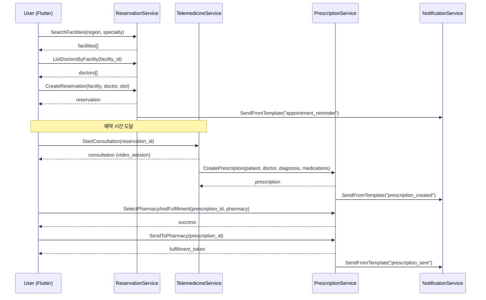
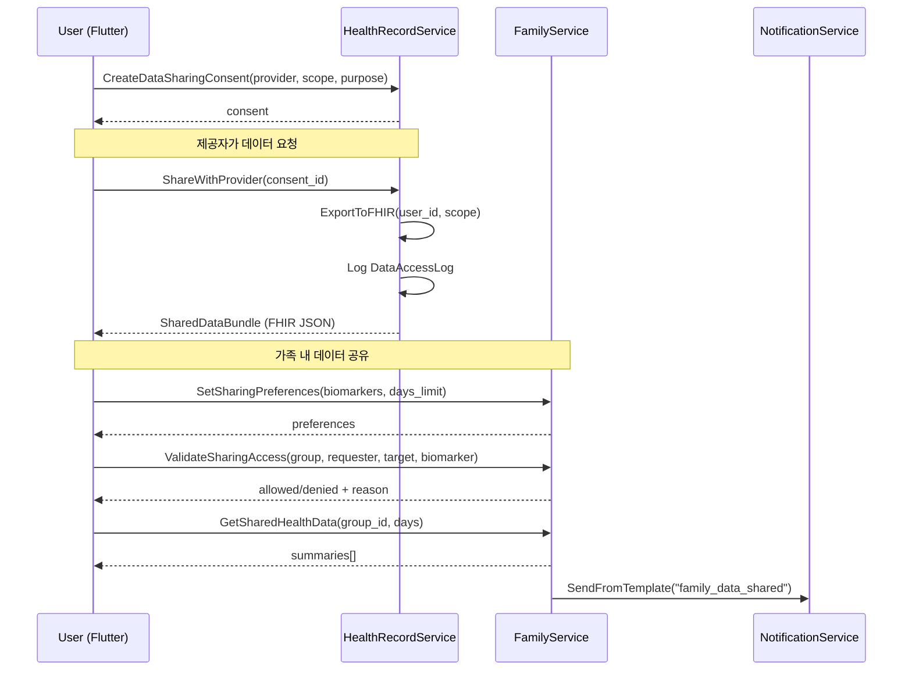
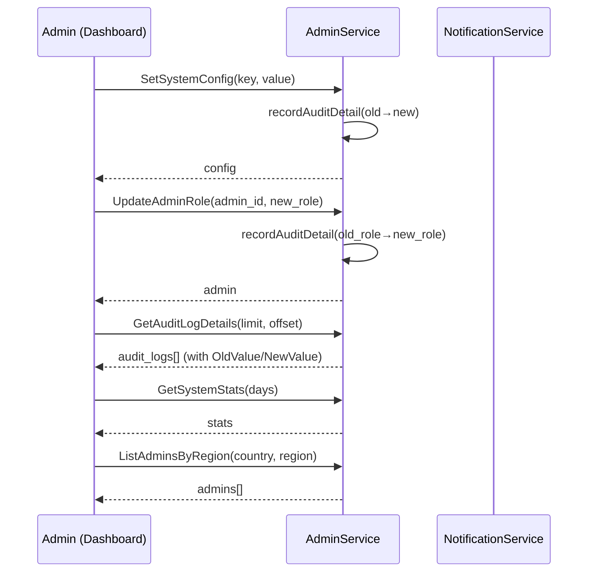
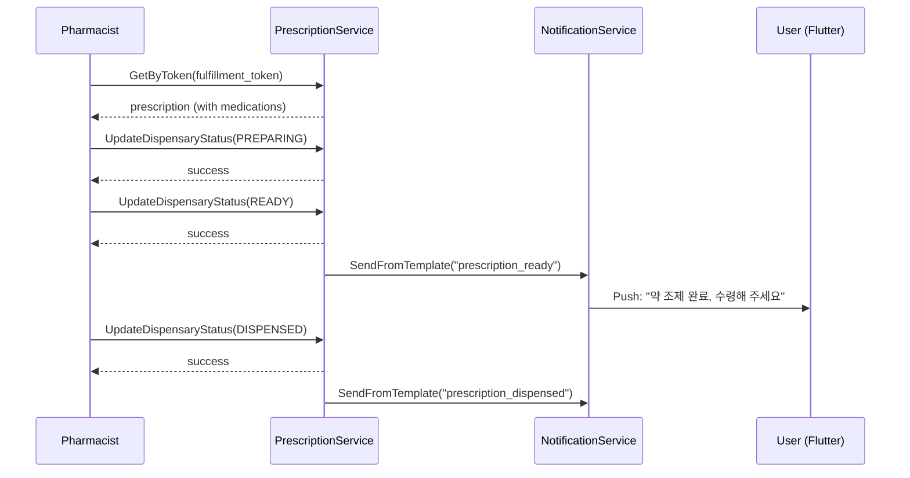
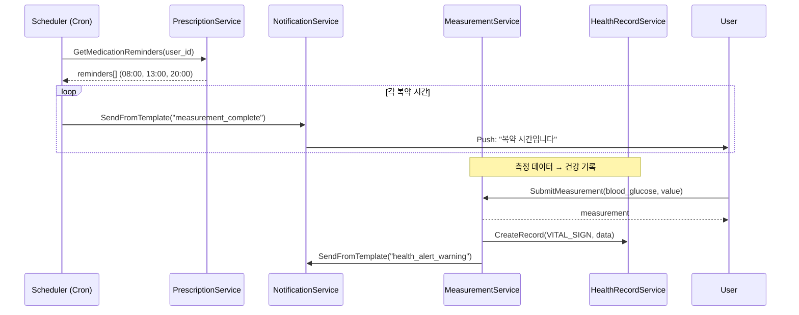

# Agent E — 서비스간 호출 다이어그램 & Proto 병합 프레임워크

> Sprint 1 | Agent E 산출물 | 2026-02-14

## 1. 서비스 아키텍처 개요

```
┌─────────────────────────────────────────────────────────────┐
│                      Flutter App (Frontend)                  │
│  auth / measurement / reservation / prescription / family   │
└─────────────────┬───────────────────────────────────────────┘
                  │ gRPC (TLS)
┌─────────────────▼───────────────────────────────────────────┐
│                     API Gateway (Envoy)                       │
│              JWT validation · Rate limiting                   │
└──┬────┬────┬────┬────┬────┬────┬────┬────┬────┬────┬───────┘
   │    │    │    │    │    │    │    │    │    │    │
   ▼    ▼    ▼    ▼    ▼    ▼    ▼    ▼    ▼    ▼    ▼
┌────┐┌────┐┌────┐┌────┐┌────┐┌────┐┌────┐┌────┐┌────┐
│Auth││Meas││Resv││Prsc││Hlth││Fam ││Noti││Admn││Tele│ ...
│Svc ││Svc ││Svc ││Svc ││Rec ││Svc ││Svc ││Svc ││Svc │
└──┬─┘└──┬─┘└──┬─┘└──┬─┘└──┬─┘└──┬─┘└──┬─┘└──┬─┘└──┬─┘
   │     │     │     │     │     │     │     │     │
   └─────┴─────┴─────┴─────┴─────┴─────┴─────┴─────┘
                          │
                    ┌─────▼──────┐
                    │   Kafka    │  (Async Events)
                    │  Cluster   │
                    └─────┬──────┘
                          │
            ┌─────────────┼──────────────┐
            ▼             ▼              ▼
      ┌──────────┐ ┌──────────┐  ┌──────────┐
      │PostgreSQL│ │  Redis   │  │Rust Core │
      │ (per-svc)│ │ (cache)  │  │ (BLE/AI) │
      └──────────┘ └──────────┘  └──────────┘
```

## 2. 서비스간 동기 호출 (gRPC)

### 2.1 진료 예약 → 원격진료 → 처방 플로우



### 2.2 데이터 공유 동의 → FHIR Export 플로우



### 2.3 Admin 감사 & 시스템 설정 플로우



### 2.4 약국 조제 상태 머신 플로우



### 2.5 복약 알림 & 건강 모니터링 플로우



## 3. 서비스간 비동기 이벤트 (Kafka)

### 3.1 Kafka Topic 구조

| Topic | Producer | Consumers | 이벤트 유형 |
|-------|----------|-----------|------------|
| `reservation-events` | reservation-service | notification-service, admin-service | reservation.created, reservation.cancelled |
| `prescription-events` | prescription-service | notification-service, admin-service | prescription.created, prescription.sent_to_pharmacy, prescription.dispensed |
| `measurement-events` | measurement-service | health-record-service, coaching-service, notification-service | measurement.submitted, measurement.alert |
| `health-record-events` | health-record-service | admin-service | consent.created, consent.revoked, data.shared |
| `family-events` | family-service | notification-service | member.invited, member.joined, data.shared |
| `admin-events` | admin-service | notification-service | config.changed, user.banned |
| `auth-events` | auth-service | admin-service | user.registered, user.login |

### 3.2 이벤트 스키마 표준

모든 Kafka 이벤트는 다음 공통 헤더를 포함:

```json
{
  "event_id": "uuid",
  "event_type": "domain.action",
  "source_service": "service-name",
  "timestamp": "2026-02-14T00:00:00Z",
  "correlation_id": "request-trace-id",
  "payload": { ... }
}
```

## 4. Proto 병합 프레임워크

### 4.1 필드 번호 할당 규칙

| 범위 | 소유자 | 상태 |
|------|--------|------|
| 1–199 | 기존 proto (공통) | 사용 중 |
| 200–249 | Agent A (의료/예약) | Phase 2 확장 |
| 250–299 | Agent B (처방/약국) | Phase 2 확장 |
| 300–349 | Agent C (데이터 공유/FHIR) | Phase 2 확장 |
| 350–399 | Agent D (기반 서비스) | Phase 2 확장 |
| 400–499 | 예약 (Sprint 2+) | 미사용 |

### 4.2 병합 절차 (5단계)

```
Step 1: 브랜치 생성
  └── git checkout -b sprint1/proto-extension

Step 2: 각 Agent 제안서 순차 반영
  ├── Agent A: Enum (FacilityType, Specialty, ReservationStatus)
  │           Message (Region, Facility 확장, Doctor, TimeSlot)
  │           RPC (ListDoctors, GetDoctorAvailability, SelectDoctor, ListRegions)
  ├── Agent B: Enum (FulfillmentType, DispensaryStatus, InteractionSeverity)
  │           Message (Medication 확장, DrugInteraction, MedicationReminder, FulfillmentToken)
  │           RPC (SelectPharmacy, SendToPharmacy, GetByToken, UpdateDispensary, CheckInteraction, GetReminders)
  ├── Agent C: Enum (ConsentType, ConsentStatus, FHIRResourceType, HealthRecordType)
  │           Message (DataSharingConsent, DataAccessLog, SharedDataBundle, HealthRecord 확장)
  │           RPC (ExportFHIR, ImportFHIR, HealthSummary, Consent CRUD, ShareWithProvider, AccessLog)
  └── Agent D: Enum (AdminRole, FamilyRole, InvitationStatus, NotificationChannel, NotificationPriority)
              Message (AuditLogDetail, SharingPreferences, SharedHealthSummary, NotificationTemplate)
              RPC (ListAdminsByRegion, AuditLogDetails, SendFromTemplate, SharingPrefs, ValidateAccess, SharedHealth)

Step 3: protoc 컴파일
  └── protoc --go_out=. --go-grpc_out=. manpasik.proto
      # 생성 파일: shared/gen/go/v1/manpasik.pb.go, manpasik_grpc.pb.go

Step 4: 빌드 검증
  └── GOWORK=off go build ./services/...

Step 5: Phase 3 핸들러 구현
  └── 각 서비스의 handler/grpc.go에서 신규 RPC 구현
```

### 4.3 충돌 방지 규칙

1. **필드 번호**: 각 Agent는 자신의 범위만 사용 (겹치지 않음)
2. **Enum 이름**: 접두사로 도메인 구분 (`FACILITY_TYPE_`, `DISPENSARY_STATUS_` 등)
3. **Message 이름**: 도메인 명사 사용, 기존 메시지와 충돌 시 접두사 추가
4. **RPC 이름**: 동사+명사 패턴, 서비스별 고유 (동일 서비스 내 중복 불가)
5. **Import**: 외부 proto import 금지 (google/protobuf만 허용)

### 4.4 Proto 변경 후 검증 체크리스트

- [ ] `protoc` 컴파일 에러 없음
- [ ] `go build ./services/...` 21/21 PASS
- [ ] `go test ./services/.../service/... -count=1` 21/21 PASS
- [ ] 기존 필드 번호 변경 없음 (하위 호환성)
- [ ] 기존 RPC 시그니처 변경 없음
- [ ] Enum 값 0은 항상 UNSPECIFIED
