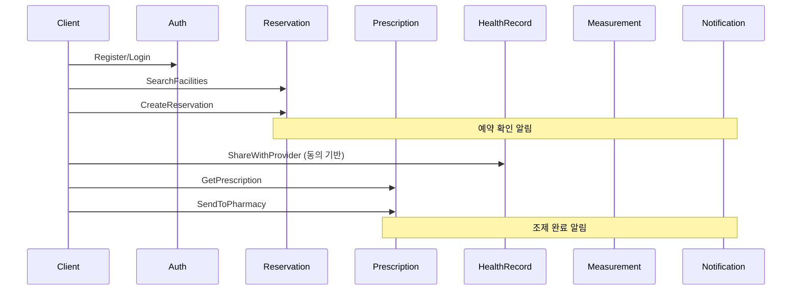

# 에이전트 작업 지시서 v1.0

**발행일**: 2026-02-11  
**기반**: agent-task-briefs.md, detailed-implementation-plan-v1.0.md  
**상태**: Phase 3 Proto 정의 완료, 13/13 서비스 빌드·테스트 PASS

---

## 공통 규칙 (모든 에이전트 필독)

### 1. 코드 수정 범위
- **자기 담당 서비스 디렉토리만 수정** (`backend/services/{서비스명}/`)
- `shared/` 디렉토리 수정 금지 (Agent E가 통합 관리)
- `manpasik.proto` 직접 수정 금지 → Proto 확장이 필요한 경우 `docs/plan/proto-extension-{agent}.md`에 제안서 작성

### 2. 작업 흐름
```
Phase 1 (즉시): 서비스 로직 + 리포지토리 구현 (Proto 변경 불필요)
Phase 2 (합의 후): Proto 확장 제안 → Agent E 수집·병합 → make proto
Phase 3 (재생성 후): 핸들러 구현 (생성된 v1 타입 사용)
```

### 3. 품질 기준
- 커밋 전 필수: `go build ./services/{서비스명}/cmd/`
- 단위 테스트: 신규 로직에 테스트 필수 (`go test ./services/{서비스명}/...`)
- 기존 테스트 깨뜨리지 않기

### 4. 진행 보고
- 작업 완료 시 `docs/plan/agent-{X}-progress.md` 에 기록
- 다른 에이전트에게 영향이 있는 변경은 즉시 `CHANGELOG.md`에 기록

---

## Agent A: 의료·예약 도메인

### 즉시 착수 (Phase 1 — Proto 변경 없이 가능)

#### Task A-1: 구역별 검색 서비스 로직 구현
**파일**: `backend/services/reservation-service/internal/service/reservation.go`

현재 `SearchFacilities`는 단순 키워드 매칭. 다음을 추가:
```go
// Region 구조체 추가
type Region struct {
    ID           string
    CountryCode  string  // "KR", "US", "JP"
    RegionCode   string  // "seoul", "tokyo"
    DistrictCode string  // "gangnam", "shibuya"
    Name         string
    ParentID     string
}

// RegionRepository 인터페이스 추가
type RegionRepository interface {
    ListRegions(ctx context.Context, countryCode string) ([]*Region, error)
    GetRegion(ctx context.Context, regionID string) (*Region, error)
}
```
- `SearchFacilities`에 `countryCode`, `regionCode`, `districtCode` 파라미터 추가
- 위도/경도 기반 거리 계산 로직: `Haversine(lat1, lon1, lat2, lon2) float64`
- Facility 구조체에 `CountryCode`, `RegionCode`, `DistrictCode`, `Timezone` 필드 추가

**파일**: `backend/services/reservation-service/internal/repository/memory/reservation.go`
- `RegionRepository` 인메모리 구현 (시드 데이터: 한국 5개 지역, 일본 3개 지역)
- `FacilityRepository` 에 지역 필터 추가

#### Task A-2: 의사 프로필 확장
**파일**: `backend/services/reservation-service/internal/service/reservation.go`
```go
// Doctor 구조체 확장
type Doctor struct {
    // 기존 필드...
    NextAvailableAt    time.Time
    ConsultationFee    int32
    AcceptsTelemedicine bool
    AvailableRegionCodes []string
}
```
- `GetDoctorAvailability(ctx, doctorID string, date time.Time)` 메서드 추가
- `SelectDoctor(ctx, facilityID, doctorID, userID string)` 메서드 추가

#### Task A-3: 단위 테스트
**파일**: `backend/services/reservation-service/internal/service/reservation_test.go`
- `TestSearchFacilitiesByRegion` — 지역 필터링 테스트
- `TestHaversineDistance` — 거리 계산 정확성
- `TestGetDoctorAvailability` — 의사 스케줄 조회
- `TestSelectDoctor` — 의사 선택 로직

#### Task A-4: Proto 확장 제안서
**파일**: `docs/plan/proto-extension-agent-a.md`
- `ListRegions` RPC 제안
- `SelectDoctor` RPC 제안
- `GetDoctorAvailability` RPC 제안
- Facility/Doctor message 확장 필드 제안

**완료 기준**: `go build && go test` PASS, 테스트 5개 이상

---

## Agent B: 처방·약국·배송 도메인

### 즉시 착수 (Phase 1)

#### Task B-1: 처방전 약국 전송 서비스 로직
**파일**: `backend/services/prescription-service/internal/service/prescription.go`

```go
// FulfillmentType 상수
type FulfillmentType string
const (
    FulfillmentPickup   FulfillmentType = "PICKUP"
    FulfillmentCourier  FulfillmentType = "COURIER"
    FulfillmentDelivery FulfillmentType = "DELIVERY"
)

// Prescription 구조체 확장
// 기존 필드에 추가:
//   PharmacyID       string
//   FulfillmentType  FulfillmentType
//   ShippingAddress  string
//   FulfillmentToken string
//   DispensaryStatus string  // "pending", "preparing", "ready", "dispensed"
```

신규 메서드:
- `SelectPharmacyAndFulfillment(ctx, prescriptionID, pharmacyID string, fulfillment FulfillmentType, shippingAddr string) error`
- `SendPrescriptionToPharmacy(ctx, prescriptionID string) (*FulfillmentToken, error)`
  - 처방전 검증 → 토큰 생성 → 상태 변경(ACTIVE→SENT)
- `GetFulfillmentToken(ctx, token string) (*Prescription, error)`
  - 약국이 토큰으로 처방전 조회
- `UpdateDispensaryStatus(ctx, prescriptionID, status string) error`
  - 약국이 조제 상태 업데이트

#### Task B-2: 약국 검색 연동
**파일**: `backend/services/prescription-service/internal/service/prescription.go`
- 약국 검색은 `reservation-service`의 `SearchFacilities(type=PHARMACY)` 를 호출
- 현재는 서비스 내에서 stub으로 구현:
```go
type PharmacySearcher interface {
    SearchNearbyPharmacies(ctx context.Context, lat, lon float64, radiusKm float64) ([]*Pharmacy, error)
}
```

#### Task B-3: 처방전 토큰 시스템
**파일**: `backend/services/prescription-service/internal/service/prescription.go`
```go
// FulfillmentToken: 일회용 토큰 (6자리 영숫자, 24시간 유효)
type FulfillmentToken struct {
    Token       string
    PrescriptionID string
    PharmacyID  string
    ExpiresAt   time.Time
    IsUsed      bool
}
```

#### Task B-4: 리포지토리 확장
**파일**: `backend/services/prescription-service/internal/repository/memory/prescription.go`
- 처방전 저장소에 `FulfillmentToken` CRUD 추가
- `FindByPharmacyID`, `FindByFulfillmentToken` 메서드 추가

#### Task B-5: 단위 테스트
**파일**: `backend/services/prescription-service/internal/service/prescription_test.go`
- `TestSelectPharmacyAndFulfillment` — 약국 선택 + 수령 방식
- `TestSendPrescriptionToPharmacy` — 토큰 생성, 상태 변경
- `TestGetFulfillmentToken` — 토큰 조회, 만료 검증
- `TestUpdateDispensaryStatus` — 조제 상태 업데이트 흐름

#### Task B-6: Proto 확장 제안서
**파일**: `docs/plan/proto-extension-agent-b.md`
- `SelectPharmacyAndFulfillment` RPC
- `SendPrescriptionToPharmacy` RPC
- `GetFulfillmentToken` RPC
- `UpdateDispensaryStatus` RPC
- `FulfillmentType` enum, `FulfillmentToken` message

**완료 기준**: `go build && go test` PASS, 테스트 4개 이상

---

## Agent C: 데이터 공유·동의·FHIR 도메인

### 즉시 착수 (Phase 1)

#### Task C-1: 동의 관리 서비스 로직
**파일**: `backend/services/health-record-service/internal/service/healthrecord.go`

```go
// DataSharingConsent 구조체
type DataSharingConsent struct {
    ID              string
    UserID          string
    ProviderID      string    // 의료기관 ID (facility_id)
    ProviderName    string
    ConsentType     string    // "measurement_share", "record_share", "full_access"
    Scope           []string  // ["blood_glucose", "blood_pressure", ...]
    Purpose         string    // "treatment", "research", "emergency"
    Status          string    // "active", "revoked", "expired"
    GrantedAt       time.Time
    ExpiresAt       time.Time
    RevokedAt       time.Time
}

// ConsentRepository 인터페이스
type ConsentRepository interface {
    Create(ctx context.Context, consent *DataSharingConsent) error
    GetByID(ctx context.Context, consentID string) (*DataSharingConsent, error)
    ListByUser(ctx context.Context, userID string) ([]*DataSharingConsent, error)
    Revoke(ctx context.Context, consentID string) error
    CheckAccess(ctx context.Context, userID, providerID, scope string) (bool, error)
}
```

신규 메서드:
- `CreateDataSharingConsent(ctx, consent *DataSharingConsent) (*DataSharingConsent, error)`
- `RevokeDataSharingConsent(ctx, consentID, reason string) error`
- `ListDataSharingConsents(ctx, userID string) ([]*DataSharingConsent, error)`
- `ShareWithProvider(ctx, consentID string) (*SharedDataBundle, error)`
  - 동의 확인 → 해당 범위 데이터 수집 → FHIR Bundle 생성
- `GetDataAccessLog(ctx, userID string) ([]*DataAccessLog, error)`

#### Task C-2: FHIR Observation 매핑
**파일**: `backend/services/health-record-service/internal/service/fhir_mapper.go` (신규 생성)

```go
// BiomarkerToLOINC 매핑 테이블
var BiomarkerLOINCMap = map[string]string{
    "blood_glucose":     "15074-8",  // Glucose [Moles/volume] in Blood
    "blood_pressure":    "85354-9",  // Blood pressure panel
    "cholesterol_total": "2093-3",   // Cholesterol [Mass/volume] in Serum
    "hemoglobin_a1c":    "4548-4",   // Hemoglobin A1c/Hemoglobin.total in Blood
    "creatinine":        "2160-0",   // Creatinine [Mass/volume] in Serum
    // ... 최소 15개 매핑
}

func MeasurementToFHIRObservation(summary *MeasurementSummary, patientRef string) map[string]interface{}
func BuildFHIRBundle(observations []map[string]interface{}) string
```

#### Task C-3: 인메모리 리포지토리
**파일**: `backend/services/health-record-service/internal/repository/memory/consent.go` (신규 생성)
- `ConsentRepository` 인메모리 구현
- `DataAccessLogRepository` 인메모리 구현

#### Task C-4: 단위 테스트
**파일**: `backend/services/health-record-service/internal/service/healthrecord_test.go`
- `TestCreateDataSharingConsent` — 동의 생성
- `TestRevokeDataSharingConsent` — 동의 철회, 이미 철회된 건 에러
- `TestCheckAccess` — 범위별 접근 확인
- `TestShareWithProvider` — 동의 기반 데이터 공유
- `TestMeasurementToFHIRObservation` — FHIR 변환 정확성

#### Task C-5: Proto 확장 제안서
**파일**: `docs/plan/proto-extension-agent-c.md`
- `CreateDataSharingConsent` RPC
- `RevokeDataSharingConsent` RPC
- `ListDataSharingConsents` RPC
- `ShareWithProvider` RPC
- `DataSharingConsent`, `SharedDataBundle`, `DataAccessLog` messages

**완료 기준**: `go build && go test` PASS, 테스트 5개 이상, LOINC 매핑 15개 이상

---

## Agent D: 기반 서비스·통합 보완

### 즉시 착수 (Phase 1)

#### Task D-1: admin-service 지역 계층 확장
**파일**: `backend/services/admin-service/internal/service/admin.go`

```go
// Admin 구조체 확장 (이미 Region/Branch 필드 존재, 세분화)
// CountryCode, RegionCode, DistrictCode 필드 추가 로직
// ListAdminsByRegion(ctx, countryCode, regionCode string) 메서드 추가
```

**파일**: `backend/services/admin-service/internal/repository/memory/admin.go`
- 시드 데이터에 지역 코드 추가 (KR-seoul-gangnam, KR-busan-haeundae 등)
- 지역별 필터링 로직

#### Task D-2: measurement-service FHIR Export 핸들러 연결
**파일**: `backend/services/measurement-service/internal/service/measurement.go`
- `ExportToFHIRObservations` 메서드는 이미 존재 (이전 세션에서 구현)
- 출력 검증: FHIR R4 Observation Bundle 스키마 준수 확인
- 추가: `ExportSingleMeasurement(ctx, sessionID string) (string, error)` — 단일 세션 FHIR 변환

#### Task D-3: notification-service 알림 템플릿 추가
**파일**: `backend/services/notification-service/internal/service/notification.go`

```go
// 처방 관련 알림 템플릿
var PrescriptionTemplates = map[string]NotificationTemplate{
    "prescription_created":  {Title: "새 처방전", Body: "%s 의사가 처방전을 발행했습니다"},
    "prescription_sent":     {Title: "처방전 전송 완료", Body: "%s 약국에 처방전이 전송되었습니다"},
    "prescription_ready":    {Title: "약 조제 완료", Body: "%s 약국에서 약 조제가 완료되었습니다"},
    "prescription_dispensed":{Title: "약 수령 완료", Body: "처방전 수령이 확인되었습니다"},
}

// 배송 관련 알림 템플릿
var DeliveryTemplates = map[string]NotificationTemplate{
    "delivery_started":  {Title: "배송 출발", Body: "처방약이 배송을 시작했습니다"},
    "delivery_arrived":  {Title: "배송 완료", Body: "처방약이 도착했습니다"},
}
```

#### Task D-4: family-service 공유 범위 세분화
**파일**: `backend/services/family-service/internal/service/family.go`
- `SharingPreferences` 구조체에 추가:
  - `MeasurementDaysLimit int` — 최근 N일 데이터만 공유
  - `AllowedBiomarkers []string` — 특정 바이오마커만 공유
  - `RequireApproval bool` — 매번 승인 필요 여부

#### Task D-5: 21서비스 보완 항목표
**파일**: `docs/plan/agent-d-service-gap-matrix.md` (신규 생성)

각 서비스별 현황표:
| 서비스 | 현재 상태 | 보완 필요 항목 | 우선순위 |
|--------|----------|---------------|---------|
| auth | 완료 | 2FA, OAuth2 | P2 |
| ... | ... | ... | ... |

#### Task D-6: 단위 테스트
- `TestListAdminsByRegion`
- `TestExportSingleMeasurementFHIR`
- `TestPrescriptionNotificationTemplate`
- `TestFamilySharingPreferencesExtended`

**완료 기준**: `go build && go test` PASS (4개 서비스), 보완 항목표 작성

---

## Agent E: 통합·검증

### 착수 조건: Agent A~D Phase 1 완료 후 (또는 병렬 시작 가능한 부분부터)

#### Task E-1: 즉시 착수 가능 — 서비스간 호출 다이어그램
**파일**: `docs/plan/agent-e-service-interaction-diagram.md`

Mermaid로 작성:


#### Task E-2: 즉시 착수 가능 — Proto 확장 수집 프레임워크
**파일**: `docs/plan/proto-extension-merge-plan.md`
- Agent A~D의 Proto 확장 제안서 수집 기준 정의
- 필드 번호 충돌 방지 규칙 (각 서비스별 필드 번호 범위 할당)
- 병합 절차: 수집 → 검토 → 충돌 해결 → 병합 → make proto → 검증

#### Task E-3: A~D 완료 후 — Proto 확장 병합
- Agent A~D의 `docs/plan/proto-extension-agent-{X}.md` 수집
- `manpasik.proto` 에 병합
- `make proto` 실행
- 전체 빌드 검증

#### Task E-4: A~D 완료 후 — E2E 시나리오 구현
**파일**: `backend/tests/e2e/` (기존 파일 확장 + 신규 파일)

우선순위 시나리오:
1. **E2E-1**: 전체 진료 플로우 (회원가입 → 시설검색 → 예약 → 진료 → 처방 → 약국)
2. **E2E-2**: 데이터 공유 플로우 (동의 생성 → 측정 → FHIR 내보내기 → 제공자 공유)
3. **E2E-3**: 가족 공유 플로우 (가족 생성 → 권한 설정 → 데이터 공유)

#### Task E-5: 통합 테스트 체크리스트
**파일**: `docs/plan/integration-test-checklist.md`
- 서비스 간 호출 매트릭스 (어떤 서비스가 어떤 서비스를 호출하는지)
- 각 호출에 대한 테스트 케이스
- 장애 시나리오 (서비스 다운, 타임아웃 등)

**완료 기준**: 다이어그램 완성, Proto 병합 성공, E2E 시나리오 3개 이상 구현

---

## 일정 계획

```
Day 1-3:  Agent A, B, C, D → Phase 1 (서비스 로직 + 테스트)
          Agent E → Task E-1, E-2 (다이어그램, 병합 프레임워크)

Day 4:    Agent A, B, C, D → Proto 확장 제안서 제출
          Agent E → 제안서 수집·검토

Day 5:    Agent E → Proto 병합 + make proto + 빌드 검증
          Agent A, B, C, D → 핸들러 구현 (Phase 3)

Day 6-7:  Agent E → E2E 테스트 구현
          전체 → 교차 검토, 버그 수정

Day 8:    최종 통합 빌드·테스트 → 완료
```

---

## 에이전트 간 인터페이스 약정

| From | To | 인터페이스 | 약정 |
|------|----|-----------|------|
| A | B | `SearchFacilities(type=PHARMACY)` | A가 구현, B가 stub 인터페이스로 호출 |
| A | D | `Region` 모델 | 동일 구조체 사용, D가 admin에 적용 |
| B | A | `Pharmacy` = `Facility(type=PHARMACY)` | proto의 FacilityType 사용 |
| C | D | FHIR LOINC 매핑 | C가 정의, D가 measurement에 적용 |
| C | A | `facility_id` 참조 | 기존 proto 필드 사용 |
| ALL | E | Proto 확장 제안서 | Day 4까지 제출 |

---

**이 문서를 각 에이전트에게 해당 섹션 + 공통 규칙과 함께 전달하세요.**
